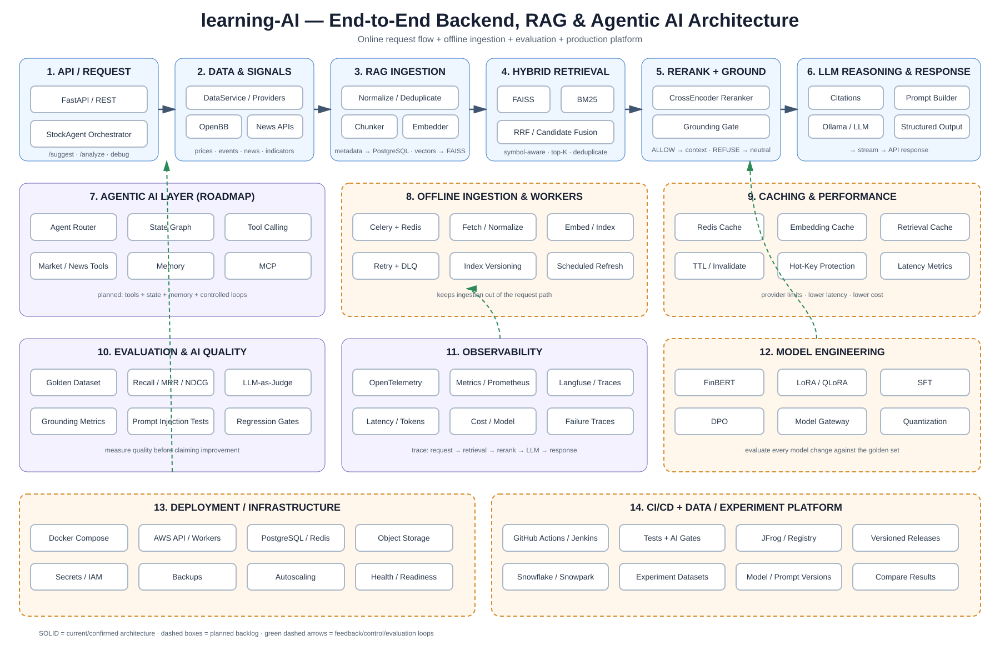

# 📈 AI Stock Recommendation Agent (Advanced RAG Pipeline)
# https://uxpilot.ai/a/ui-design?page=Gq8X7d7CTR5N876pxwcw
Welcome to the **AI Stock Recommendation Agent** repository. This project implements a production-oriented investment intelligence backend that coordinates quantitative market signals, corporate actions, semantic news retrieval and local LLM reasoning.

The core intelligence is an **Advanced RAG (Retrieval-Augmented Generation) pipeline** with hybrid retrieval, neural reranking, grounding gates and citation-aware context construction. The roadmap extends this foundation toward agentic workflows, evaluation, observability and production deployment.

---

## 🗺️ Complete Backend Architecture & Flow

The diagram below is the primary architecture map for the project. It shows the **online request path**, **offline ingestion path**, **RAG retrieval flow**, **grounding/refusal boundary**, **LLM response path**, and the planned **agentic, evaluation, observability and production layers**.



### Detailed component documentation

For the responsibility, data flow, boundaries, current implementation status and planned evolution of each backend component, see **[Component Documentation](docs/components/README.md)**.

### How to read the diagram

- **Solid blue boxes** = current/implemented backend architecture.
- **Dashed orange boxes** = planned backlog capabilities.
- **Purple boxes** = AI/quality supporting layers.
- **Green dashed arrows** = feedback, evaluation or control loops.
- The primary online path is: **API → Data/Signals → RAG Ingestion → Hybrid Retrieval → Reranking → Grounding → Citations/Prompt → LLM → Structured Response**.
- Offline workers eventually move ingestion, embedding and index maintenance out of the user request path.

---

## 🚀 Key Functional Modules

### 1. Ingestion & Market Signals
* **Decoupled Data Fetching:** Complies with the Dependency Inversion Principle (DIP). The application relies on provider abstractions to load stock prices, news and corporate events.
* **Multi-Source News Routing:** Uses OpenBB plus external news providers such as Marketaux and GNews, allowing different market/ticker sources to be combined behind the data-service layer.
* **Signal Processing:** Market, news and event signals are combined before the reasoning stage.

### 2. Advanced RAG Ingestion Pipeline
* **Text Chunking:** News titles/summaries are normalized and split into retrieval chunks with configurable size and overlap.
* **Embeddings:** Local sentence-transformer embeddings convert chunks into dense vectors.
* **Vector Index:** FAISS stores semantic vectors for fast similarity retrieval.
* **Metadata Store:** PostgreSQL stores chunk metadata and the mapping required to reconcile vector results with source documents.

### 3. Online Hybrid Retrieval & Neural Rerank
* **Semantic Search:** FAISS retrieves candidates based on vector similarity.
* **Keyword Search:** BM25 retrieves candidates based on lexical relevance.
* **Hybrid Retrieval:** Candidates are merged, deduplicated and ranked using the hybrid retrieval strategy.
* **Cross-Encoder Reranking:** A local CrossEncoder scores query/document pairs and produces the final relevance ordering.

### 4. Grounding & Citation Boundary
* **Grounding Gate:** Retrieved evidence is checked against configurable relevance/coverage thresholds.
* **Early Refusal:** If evidence is insufficient, the system bypasses LLM reasoning and returns a neutral insufficient-evidence response.
* **Citation Context:** When grounding succeeds, source chunks are converted into citation-aware context for the LLM.
* **Safety boundary:** The LLM is not treated as the source of truth. Retrieved evidence must pass the grounding stage first.

### 5. Local LLM Reasoning
* **Private Inference:** The current implementation uses a local Ollama-backed model.
* **Financial Prompting:** Market signals and grounded evidence are provided to the reasoning layer.
* **Structured response roadmap:** Free-form parsing is being replaced by schema-constrained structured generation as part of the backlog.

### 6. Agentic AI Roadmap
The next layer evolves the request pipeline into a controlled agent workflow:

* **Agent Router:** Selects the appropriate reasoning/tool path.
* **State Graph:** Represents deterministic agent states and transitions.
* **Tool Calling:** Exposes market, news, RAG and calculation capabilities through validated schemas.
* **Memory:** Separates conversation/user/semantic memory with explicit retention rules.
* **MCP:** Provides a standard tool/context interface for external agent integrations.

### 7. Evaluation & Observability
The project roadmap includes evaluation as a first-class engineering layer rather than relying on subjective LLM output inspection:

* Retrieval metrics: **Recall@K, MRR, NDCG**.
* Grounding metrics: evidence sufficiency, refusal precision/recall and calibration.
* LLM evaluation: structured-output validity, citation correctness, faithfulness and LLM-as-judge comparisons.
* Security evaluation: prompt-injection and retrieval-poisoning regression tests.
* Observability: traces across API → retrieval → reranking → grounding → LLM, plus latency, token and model metrics.

### 8. Offline Ingestion & Production Platform
The planned production path separates user requests from expensive ingestion work:

* Celery + Redis for background ingestion.
* Retry/backoff and dead-letter handling.
* Incremental ingestion and index reconciliation.
* Redis caching with TTL, invalidation and hot-key protection.
* Dockerized API, database, cache, workers and local model services.
* AWS deployment boundaries, secrets/IAM, backups and health/readiness checks.
* CI/CD with automated tests, AI quality gates, security scanning and versioned artifacts.

---

## 🛠️ Setup & Local Execution

### 1. Requirements & Dependencies

Make sure you have **PostgreSQL** running locally and **Ollama** installed and listening on port `11434`.

Initialize the virtual environment and fetch dependencies using the `uv` tool:

```bash
uv sync
```

### 2. Configure Environment Parameters

Create a `.env` file inside the `stock-agent/` directory:

```env
DB_URL=postgresql+asyncpg://stock_agent_admin:<password>@localhost:5432/stock_agent
MARKETAUX_API_KEY=your_key_here
GNEWS_API_KEY=your_key_here
LLM_MODEL=phi3:mini
OLLAMA_LOCAL_URL=http://localhost:11434
GROUNDING_MIN_SCORE=-7.0
GROUNDING_MIN_TOP3_AVERAGE=-10.5
GROUNDING_MIN_CHUNKS=1
```

Never commit real credentials to the repository.

### 3. Initialize Database Schemas

```bash
uv run python stock-agent/setup_db.py
```

### 4. Start the Application Server

```bash
uv run python stock-agent/main.py
```

The server listens on **`http://127.0.0.1:8000`**. Interactive Swagger documentation is available at `/docs`.

---

## 🧪 Verification, Evaluation & Benchmarking

### 1. Subsystem Readiness Probes
<<<<<<< HEAD
The **`GET /health`** route performs real runtime status checks of external subsystems (confirming PostgreSQL async reachability, FAISS indexes loaded on disk, and Ollama server responsiveness). It also verifies news freshness, warning if no new articles have been indexed within the last 24 hours.
=======

The **`GET /health`** route performs runtime checks of external subsystems such as PostgreSQL, FAISS indexes and the Ollama server.
>>>>>>> 842a13e9f4f0b5095483048aa65f5687f97e6318

### 2. Intermediate QA Debug Routes

Use debug POST endpoints to trace the RAG pipeline without calling the LLM:

* **`POST /debug/retrieval`**: Inspect FAISS, BM25 and merged candidate results.
* **`POST /debug/rerank`**: Inspect CrossEncoder ranking and scores.
* **`POST /debug/grounding`**: Inspect grounding rule outcomes.

### 3. Automated Test Suite

```bash
uv run pytest stock-agent/tests/
```

### 4. Golden Dataset Evaluation Framework (Phase 2.7 & Closure)
Evaluate the active model against a golden dataset of 100+ test cases:
```bash
# Run the evaluation engine (in mock/simulation mode)
uv run python stock-agent/evaluation/run_evaluation.py --mock
```
This produces `evaluation_report.md` summarizing precision, recall, and grounding metrics.

### 5. Multi-Model Benchmarking Leaderboard (Phase 2.8)
Benchmark and rank all supported models (`qwen2.5:3b`, `mistral:7b`, `llama3.1:8b`, `phi4`, `gemma3`) on a weighted score matrix:
```bash
# Run the benchmark engine
uv run python stock-agent/evaluation/run_benchmark.py --mock
```
This generates:
* Model comparison report: [model_benchmark_report.md](file:///c:/Users/bhuwa/study/ai_stock_market/stock-agent/evaluation/model_benchmark_report.md)
* Comparison rankings data: [model_rankings.json](file:///c:/Users/bhuwa/study/ai_stock_market/stock-agent/evaluation/model_rankings.json)
* Captured baseline configs: `stock-agent/evaluation/baselines/*.json`

### 6. Phase 2 Closure API Endpoints
The following endpoints were added to support frontend integrations and diagnostics:
* **`GET /capabilities`**: Returns lists of supported and unsupported capabilities (e.g. `news_analysis`, `recommendations`, etc.).
* **`GET /models`**: Returns the active model configurations.
* **`GET /pipeline/status`**: Returns health checks for critical RAG pipeline components: database, FAISS index, cross-encoder reranker, and local Ollama server status.
* **`GET /evaluation/results`**: Exposes the latest golden dataset evaluation metrics scorecard.
* **`GET /benchmark/results`**: Exposes the multi-model benchmarking rankings.
* **`POST /historical-events/search`**: Exposes semantic similarity lookups over historical macro events (e.g., searching for war or tariffs).
* **`POST /signals`**: Exposes signal extraction analytics over raw recommendation texts.

---

## 📂 Codebase Tour

<<<<<<< HEAD
* [main.py](file:///c:/Users/bhuwa/study/ai_stock_market/stock-agent/main.py): Application entry point and lifespan connection hooks.
* [src/config/settings.py](file:///c:/Users/bhuwa/study/ai_stock_market/stock-agent/src/config/settings.py): Centralized configuration loader.
* [src/metrics/](file:///c:/Users/bhuwa/study/ai_stock_market/stock-agent/src/metrics/): Metrics models and timing collection service.
* [src/llm/](file:///c:/Users/bhuwa/study/ai_stock_market/stock-agent/src/llm/): Model registry, prompt builders, text prompts, and provider abstractions.
* [src/rag/grounding.py](file:///c:/Users/bhuwa/study/ai_stock_market/stock-agent/src/rag/grounding.py): Evaluator applying the calibrated threshold rules.
* [src/rag/hybrid_retriever.py](file:///c:/Users/bhuwa/study/ai_stock_market/stock-agent/src/rag/hybrid_retriever.py): Semantic and keyword search query merger.
* [src/rag/reranker.py](file:///c:/Users/bhuwa/study/ai_stock_market/stock-agent/src/rag/reranker.py): Logit score ranks candidates.
* [src/agent/stock_agent.py](file:///c:/Users/bhuwa/study/ai_stock_market/stock-agent/src/agent/stock_agent.py): High-level brain orchestrating the analytical flow.
* [src/api/routes/debug.py](file:///c:/Users/bhuwa/study/ai_stock_market/stock-agent/src/api/routes/debug.py): REST routers exposing intermediate RAG matrices.
* [evaluation/](file:///c:/Users/bhuwa/study/ai_stock_market/stock-agent/evaluation/): Golden dataset, run scripts, ranking algorithms, and baseline metrics folder.
=======
* [main.py](stock-agent/main.py): Application entry point and lifespan hooks.
* [settings.py](stock-agent/src/config/settings.py): Centralized configuration loader.
* [grounding.py](stock-agent/src/rag/grounding.py): Grounding threshold evaluation.
* [hybrid_retriever.py](stock-agent/src/rag/hybrid_retriever.py): Semantic + keyword retrieval merger.
* [reranker.py](stock-agent/src/rag/reranker.py): CrossEncoder candidate ranking.
* [stock-agent/src/agent/stock_agent.py](stock-agent/src/agent/stock_agent.py): High-level orchestration layer.
* [debug.py](stock-agent/src/api/routes/debug.py): Intermediate RAG diagnostics.
>>>>>>> 842a13e9f4f0b5095483048aa65f5687f97e6318

---

## 📈 AI & Production Roadmap

The GitHub backlog tracks the evolution from the current RAG foundation into a production-oriented Agentic AI system.

### RAG correctness and quality

1. Idempotent ingestion and duplicate prevention.
2. Correct token-aware chunking.
3. Symbol-aware retrieval.
4. Hybrid RRF fusion.
5. Batch embedding and index lifecycle management.
6. Structured LLM output.
7. Prompt-injection and retrieval-poisoning defenses.
8. Golden datasets and automated RAG evaluation.

### Agentic AI

9. Tool calling with validation and budgets.
10. State-graph orchestration.
11. Memory and conversation state.
12. Streaming responses.
13. MCP integration.

### Production backend

14. Redis caching and cache invalidation.
15. Celery background ingestion, scheduling, retries and DLQ.
16. Dockerized development/production stack.
17. AWS deployment architecture.
18. CI/CD with AI regression gates.
19. OpenTelemetry/tracing and model observability.

### Model engineering

20. Financial-domain sentiment with FinBERT.
21. Domain-specific embedding/reranking evaluation.
22. LoRA/QLoRA fine-tuning.
23. Supervised fine-tuning (SFT).
24. Preference optimization with DPO.
25. Model gateway, fallback and quantization.

### Data and experimentation

26. Snowflake/Snowpark offline analytics and evaluation datasets.
27. Versioned datasets, prompts, models and experiment results.
28. Historical backtesting and leakage-safe evaluation.

See the repository's GitHub Issues for implementation details, dependencies, acceptance criteria and priorities.
