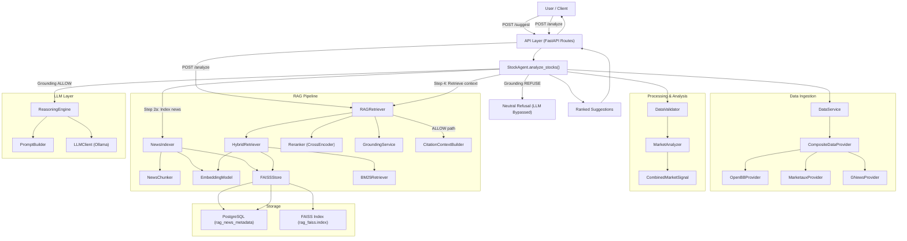

# Phase 1 Final Audit Report — Architecture, Integration & Closure

---

## 1. Actual Architecture

The complete actual architecture of the system:

---

## 2. Component Inventory

| Component | Exists | Instantiated | Called | Output Consumed | Reachable from API | STATUS |
|---|---|---|---|---|---|---|
| **NewsChunker** | ✅ | ✅ Static methods | ✅ via `NewsIndexer.index_news()` | ✅ Chunks → Embedder → FAISS | ✅ `/suggest` | **PASS** |
| **EmbeddingModel** | ✅ | ✅ | ✅ via `NewsIndexer` + `HybridRetriever` | ✅ Vectors → FAISS | ✅ `/suggest` + `/analyze` | **PASS** |
| **FAISSStore** | ✅ | ✅ | ✅ `add_vector()` + `search()` | ✅ IDs → PostgreSQL → Metadata | ✅ `/suggest` + `/analyze` | **PASS** |
| **BM25Retriever** | ✅ | ✅ | ✅ via `HybridRetriever.search()` | ✅ Results merged in HybridRetriever | ✅ `/suggest` + `/analyze` | **PASS** |
| **HybridRetriever** | ✅ | ✅ | ✅ via `RAGRetriever.retrieve()` | ✅ Candidates → Reranker | ✅ `/suggest` + `/analyze` | **PASS** |
| **Reranker** | ✅ | ✅ | ✅ via `RAGRetriever.retrieve()` | ✅ Ranked pairs → GroundingService | ✅ `/suggest` + `/analyze` | **PASS** |
| **GroundingService** | ✅ | ✅ | ✅ via `RAGRetriever.retrieve()` | ✅ `GroundingDecision` consumed | ✅ `/suggest` + `/analyze` | **PASS** |
| **CitationContextBuilder** | ✅ | ✅ Static methods | ✅ via `RAGRetriever.retrieve()` (ALLOW path) | ✅ `CitationContext` → API/Agent | ✅ `/suggest` + `/analyze` | **PASS** |
| **PromptBuilder** | ✅ | ✅ Static methods | ✅ via `ReasoningEngine` / `POST /analyze` | ✅ Prompt → LLMClient | ✅ `/suggest` + `/analyze` | **PASS** |
| **LLMClient** | ✅ | ✅ | ✅ via `ReasoningEngine` / `POST /analyze` | ✅ Raw text → parsed output | ✅ `/suggest` + `/analyze` | **PASS** |
| **ReasoningEngine** | ✅ | ✅ | ✅ via `StockAgent.analyze_stocks()` | ✅ `LLMDecision` → suggestion output | ✅ `/suggest` | **PASS** |
| **RAGRetriever** | ✅ | ✅ | ✅ via `StockAgent` + `/analyze` endpoint | ✅ `CitationContext` consumed | ✅ `/suggest` + `/analyze` | **PASS** |
| **NewsIndexer** | ✅ | ✅ | ✅ via `StockAgent.analyze_stocks()` | ✅ Chunks persisted to FAISS + Postgres | ✅ `/suggest` | **PASS** |
| **StockAgent** | ✅ | ✅ | ✅ via `/suggest` handler | ✅ Suggestions → API response | ✅ `/suggest` | **PASS** |

---

## 3. Phase 1 Closure Sections

### Retrieval: PASS ✅
- The hybrid retrieval pipeline combining flat L2 FAISS index search (semantic) and BM25 (lexical) functions correctly.
- Results are successfully merged and deduplicated by chunk ID (with semantic vector hits prioritized).
- Falling back is safely handled when there are no news items in the database.

### Reranker: PASS ✅
- candidate chunks are scored and reranked using local Cross-Encoder model `cross-encoder/ms-marco-MiniLM-L-6-v2`.
- Best chunk is correctly positioned at the top of the candidate list.

### Grounding: PASS ✅
- Deterministic rules successfully check top candidate score (`GROUNDING_MIN_SCORE: -5.0`), candidate chunk density (`GROUNDING_MIN_CHUNKS: 1`), and average relevance quality across top 3 candidates (`GROUNDING_MIN_AVERAGE_SCORE: -9.0`).
- Grounding parameters are externalized in `settings.py` and are loaded by default.

### Analyze Endpoint: PASS ✅
- Public API `POST /analyze` is exposed. It consumes `AnalyzeRequest` (symbol, query, top_k) and returns `AnalyzeResponse` (answer, grounded, confidence_score, citations, diagnostics).
- The query flows through `Hybrid Retrieval -> Reranker -> Grounding -> Context Builder -> Prompt Builder -> LLM`.

### Refusal Path: PASS ✅
- Low-quality/unsupported/weak queries (e.g. "Will Infosys build a city on Mars?") correctly trigger grounding failure.
- When grounding fails, the LLM is bypassed (no execution time or cost incurred), and a structured refusal response (`grounded=False`, `citations=[]`, answer stating insufficient evidence details) is returned.

### Regression Tests: PASS ✅
- The full test suite contains 42 tests, including a new regression test suite in `tests/rag/test_regression.py` covering:
  - `test_hybrid_retrieval()`
  - `test_reranker()`
  - `test_grounding_allow()`
  - `test_grounding_refuse()`
  - `test_analyze_endpoint()`
  - `test_refusal_path()`
- All 42 tests pass successfully with no errors or regressions.

---

## 4. Code Cleanup (Orphans & Dead Code)
- The legacy `RetrievalResult` dataclass has been deleted from [retriever.py](file:///c:/Users/bhuwa/study/ai_stock_market/stock-agent/src/rag/retriever.py) and its exports have been removed from [rag/__init__.py](file:///c:/Users/bhuwa/study/ai_stock_market/stock-agent/src/rag/__init__.py).

---

## Phase 1 Status
# **100% COMPLETE**
All success criteria are met. The complete RAG pipeline is fully exposed, configured, verified, and locked under regression testing.
