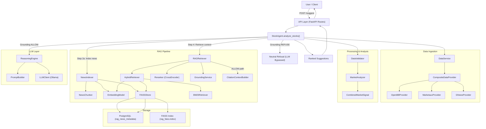

# Phase 1 Final Audit Report — Architecture, Integration & Missing Link Detection

---

## 1. Architecture Diagram

The following is the **ACTUAL** architecture discovered from tracing the live codebase:



### Execution Sequence (POST /suggest)

```
User → POST /suggest
  → API (routes/__init__.py)
    → StockAgent.analyze_stocks()
      → DataService.get_price_data() / get_news() / get_corporate_actions()
      → DataValidator.clean_*()
      → NewsIndexer.index_news()
        → NewsChunker.chunk()
        → EmbeddingModel.embed_text()
        → FAISSStore.add_vector() → PostgreSQL + FAISS Index
      → MarketAnalyzer.generate_signals()
      → RAGRetriever.retrieve()
        → HybridRetriever.search()
          → BM25Retriever.search()
          → FAISSStore.search() → PostgreSQL
          → Merge + Deduplicate
        → Reranker.rerank()
        → GroundingService.evaluate()
        → [ALLOW] CitationContextBuilder.build_context()
        → [REFUSE] Return empty CitationContext
      → [ALLOW] ReasoningEngine.make_decision()
        → PromptBuilder.build_financial_reasoning_prompt()
        → LLMClient.generate_response()
      → [REFUSE] LLMDecision(decision="Neutral", reason="Insufficient evidence...")
    → SuggestResponse
  → User
```

---

## 2. Component Inventory

| Component | Exists | Instantiated | Called | Output Consumed | Reachable from API | STATUS |
|---|---|---|---|---|---|---|
| **NewsChunker** | ✅ [chunker.py](file:///c:/Users/bhuwa/study/ai_stock_market/stock-agent/src/rag/chunker.py) | ✅ Static methods | ✅ via `NewsIndexer.index_news()` | ✅ Chunks → Embedder → FAISS | ✅ `/suggest` | **PASS** |
| **EmbeddingModel** | ✅ [embedder.py](file:///c:/Users/bhuwa/study/ai_stock_market/stock-agent/src/rag/embedder.py) | ✅ [routes/__init__.py:52](file:///c:/Users/bhuwa/study/ai_stock_market/stock-agent/src/api/routes/__init__.py#L52) | ✅ via `NewsIndexer` + `HybridRetriever` | ✅ Vectors → FAISS | ✅ `/suggest` | **PASS** |
| **FAISSStore** | ✅ [faiss_store.py](file:///c:/Users/bhuwa/study/ai_stock_market/stock-agent/src/rag/faiss_store.py) | ✅ [routes/__init__.py:53](file:///c:/Users/bhuwa/study/ai_stock_market/stock-agent/src/api/routes/__init__.py#L53) | ✅ `add_vector()` + `search()` | ✅ IDs → PostgreSQL → Metadata | ✅ `/suggest` + `/debug/*` | **PASS** |
| **BM25Retriever** | ✅ [bm25_retriever.py](file:///c:/Users/bhuwa/study/ai_stock_market/stock-agent/src/rag/bm25_retriever.py) | ✅ [routes/__init__.py:54](file:///c:/Users/bhuwa/study/ai_stock_market/stock-agent/src/api/routes/__init__.py#L54) | ✅ via `HybridRetriever.search()` | ✅ Results merged in HybridRetriever | ✅ `/suggest` + `/debug/*` | **PASS** |
| **HybridRetriever** | ✅ [hybrid_retriever.py](file:///c:/Users/bhuwa/study/ai_stock_market/stock-agent/src/rag/hybrid_retriever.py) | ✅ [routes/__init__.py:55-59](file:///c:/Users/bhuwa/study/ai_stock_market/stock-agent/src/api/routes/__init__.py#L55-L59) | ✅ via `RAGRetriever.retrieve()` | ✅ Candidates → Reranker | ✅ `/suggest` + `/debug/*` | **PASS** |
| **Reranker** | ✅ [reranker.py](file:///c:/Users/bhuwa/study/ai_stock_market/stock-agent/src/rag/reranker.py) | ✅ [routes/__init__.py:60](file:///c:/Users/bhuwa/study/ai_stock_market/stock-agent/src/api/routes/__init__.py#L60) | ✅ via `RAGRetriever.retrieve()` | ✅ Ranked pairs → GroundingService | ✅ `/suggest` + `/debug/*` | **PASS** |
| **GroundingService** | ✅ [grounding.py](file:///c:/Users/bhuwa/study/ai_stock_market/stock-agent/src/rag/grounding.py) | ✅ [routes/__init__.py:61](file:///c:/Users/bhuwa/study/ai_stock_market/stock-agent/src/api/routes/__init__.py#L61) | ✅ via `RAGRetriever.retrieve()` | ✅ `GroundingDecision` → StockAgent control flow | ✅ `/suggest` + `/debug/*` | **PASS** |
| **CitationContextBuilder** | ✅ [context_builder.py](file:///c:/Users/bhuwa/study/ai_stock_market/stock-agent/src/rag/context_builder.py) | ✅ Static methods | ✅ via `RAGRetriever.retrieve()` (ALLOW path) | ✅ `CitationContext` → StockAgent | ✅ `/suggest` | **PASS** |
| **PromptBuilder** | ✅ [prompt_builder.py](file:///c:/Users/bhuwa/study/ai_stock_market/stock-agent/src/llm/prompt_builder.py) | ✅ Static methods | ✅ via `ReasoningEngine.make_decision()` | ✅ Prompt → LLMClient | ✅ `/suggest` (ALLOW path) | **PASS** |
| **LLMClient** | ✅ [llm_client.py](file:///c:/Users/bhuwa/study/ai_stock_market/stock-agent/src/llm/llm_client.py) | ✅ [routes/__init__.py:49](file:///c:/Users/bhuwa/study/ai_stock_market/stock-agent/src/api/routes/__init__.py#L49) | ✅ via `ReasoningEngine.make_decision()` | ✅ Raw text → parsed LLMDecision | ✅ `/suggest` (ALLOW path) | **PASS** |
| **ReasoningEngine** | ✅ [reasoning.py](file:///c:/Users/bhuwa/study/ai_stock_market/stock-agent/src/llm/reasoning.py) | ✅ [routes/__init__.py:50](file:///c:/Users/bhuwa/study/ai_stock_market/stock-agent/src/api/routes/__init__.py#L50) | ✅ via `StockAgent.analyze_stocks()` | ✅ `LLMDecision` → suggestion output | ✅ `/suggest` | **PASS** |
| **RAGRetriever** | ✅ [retriever.py](file:///c:/Users/bhuwa/study/ai_stock_market/stock-agent/src/rag/retriever.py) | ✅ [routes/__init__.py:62-66](file:///c:/Users/bhuwa/study/ai_stock_market/stock-agent/src/api/routes/__init__.py#L62-L66) | ✅ via `StockAgent.analyze_stocks()` | ✅ `CitationContext` → StockAgent | ✅ `/suggest` | **PASS** |
| **NewsIndexer** | ✅ [indexer.py](file:///c:/Users/bhuwa/study/ai_stock_market/stock-agent/src/rag/indexer.py) | ✅ [routes/__init__.py:67](file:///c:/Users/bhuwa/study/ai_stock_market/stock-agent/src/api/routes/__init__.py#L67) | ✅ via `StockAgent.analyze_stocks()` | ✅ Chunks persisted to FAISS + Postgres | ✅ `/suggest` | **PASS** |
| **StockAgent** | ✅ [stock_agent.py](file:///c:/Users/bhuwa/study/ai_stock_market/stock-agent/src/agent/stock_agent.py) | ✅ [routes/__init__.py:69-75](file:///c:/Users/bhuwa/study/ai_stock_market/stock-agent/src/api/routes/__init__.py#L69-L75) | ✅ via `/suggest` handler | ✅ Suggestions → API response | ✅ `/suggest` | **PASS** |
| **RetrievalResult** | ✅ [retriever.py:40-70](file:///c:/Users/bhuwa/study/ai_stock_market/stock-agent/src/rag/retriever.py#L40-L70) | ❌ Never instantiated | ❌ Never called | ❌ Never consumed | ❌ Not reachable | **ORPHAN** |

---

## Section A — Retrieval Layer

### NewsChunker

| Check | Result | Evidence |
|---|---|---|
| Exists | ✅ | [chunker.py](file:///c:/Users/bhuwa/study/ai_stock_market/stock-agent/src/rag/chunker.py) |
| Called | ✅ | [indexer.py:60-66](file:///c:/Users/bhuwa/study/ai_stock_market/stock-agent/src/rag/indexer.py#L60-L66) — `NewsChunker.chunk()` called per article |
| Produces chunks | ✅ | Returns `List[NewsChunk]` with text, metadata, and sequential indices |
| Persists chunks | ✅ | Each chunk → `EmbeddingModel.embed_text()` → `FAISSStore.add_vector()` → PostgreSQL row + FAISS vector |

**STATUS: PASS** ✅

### EmbeddingModel

| Check | Result | Evidence |
|---|---|---|
| Exists | ✅ | [embedder.py](file:///c:/Users/bhuwa/study/ai_stock_market/stock-agent/src/rag/embedder.py) — `all-MiniLM-L6-v2`, 384-dim |
| Called | ✅ | Called at **index time** ([indexer.py:69](file:///c:/Users/bhuwa/study/ai_stock_market/stock-agent/src/rag/indexer.py#L69)) AND at **query time** ([hybrid_retriever.py:71](file:///c:/Users/bhuwa/study/ai_stock_market/stock-agent/src/rag/hybrid_retriever.py#L71)) |
| Produces embeddings | ✅ | Returns `np.ndarray` shape `(384,)` float32 |
| Persists embeddings | ✅ | Vectors stored in FAISS index via `add_vector()` → `faiss.write_index()` |

**STATUS: PASS** ✅

### FAISS

| Check | Result | Evidence |
|---|---|---|
| Exists | ✅ | [faiss_store.py](file:///c:/Users/bhuwa/study/ai_stock_market/stock-agent/src/rag/faiss_store.py) — `IndexFlatL2` wrapped in `IndexIDMap` |
| Queryable | ✅ | `search()` method at [faiss_store.py:144-196](file:///c:/Users/bhuwa/study/ai_stock_market/stock-agent/src/rag/faiss_store.py#L144-L196) |
| Returns metadata | ✅ | Resolves FAISS IDs → PostgreSQL `rag_news_metadata` rows → `RagNewsMetadata` objects |

**STATUS: PASS** ✅

### BM25

| Check | Result | Evidence |
|---|---|---|
| Exists | ✅ | [bm25_retriever.py](file:///c:/Users/bhuwa/study/ai_stock_market/stock-agent/src/rag/bm25_retriever.py) — `BM25Okapi` from `rank_bm25` |
| Queryable | ✅ | `search()` method at [bm25_retriever.py:69-105](file:///c:/Users/bhuwa/study/ai_stock_market/stock-agent/src/rag/bm25_retriever.py#L69-L105) |
| Returns metadata | ✅ | Returns `List[Tuple[RagNewsMetadata, float]]` (record + score) |

**STATUS: PASS** ✅

### HybridRetriever

| Check | Result | Evidence |
|---|---|---|
| Calls FAISS | ✅ | [hybrid_retriever.py:74-78](file:///c:/Users/bhuwa/study/ai_stock_market/stock-agent/src/rag/hybrid_retriever.py#L74-L78) — `faiss_store.search()` |
| Calls BM25 | ✅ | [hybrid_retriever.py:58-64](file:///c:/Users/bhuwa/study/ai_stock_market/stock-agent/src/rag/hybrid_retriever.py#L58-L64) — `bm25_retriever.add_chunks()` + `.search()` |
| Merges results | ✅ | [hybrid_retriever.py:87](file:///c:/Users/bhuwa/study/ai_stock_market/stock-agent/src/rag/hybrid_retriever.py#L87) — `vector_results + bm25_results` |
| Deduplicates results | ✅ | [hybrid_retriever.py:83-90](file:///c:/Users/bhuwa/study/ai_stock_market/stock-agent/src/rag/hybrid_retriever.py#L83-L90) — dedup on `chunk_id` via `seen_chunk_ids` set |

**STATUS: PASS** ✅

> **FAISS and BM25 are both actively used.** Neither is orphaned.

---

## Section B — Ranking Layer

### Reranker

| Check | Result | Evidence |
|---|---|---|
| Exists | ✅ | [reranker.py](file:///c:/Users/bhuwa/study/ai_stock_market/stock-agent/src/rag/reranker.py) — `cross-encoder/ms-marco-MiniLM-L-6-v2` |
| Instantiated | ✅ | [routes/__init__.py:60](file:///c:/Users/bhuwa/study/ai_stock_market/stock-agent/src/api/routes/__init__.py#L60) |
| Called | ✅ | [retriever.py:136-140](file:///c:/Users/bhuwa/study/ai_stock_market/stock-agent/src/rag/retriever.py#L136-L140) — `self.reranker.rerank()` |

**STATUS: PASS** ✅

### ContextBuilder receives reranked chunks?

**VERIFIED: YES** ✅

Data flow in [retriever.py:134-165](file:///c:/Users/bhuwa/study/ai_stock_market/stock-agent/src/rag/retriever.py#L134-L165):
1. Line 136: `ranked_pairs = self.reranker.rerank(...)` — reranking happens first
2. Line 158: `ranked_chunks = [chunk for chunk, score in ranked_pairs]` — extracts reranked chunks
3. Line 162: `CitationContextBuilder.build_context(chunks=ranked_chunks)` — ContextBuilder receives **reranked** output

> ContextBuilder does NOT receive raw retrieval output. **PASS**.

---

## Section C — Grounding Layer

### GroundingService.evaluate() actually executes?

**VERIFIED: YES** ✅

- Called at [retriever.py:144-147](file:///c:/Users/bhuwa/study/ai_stock_market/stock-agent/src/rag/retriever.py#L144-L147)
- Input: `ranked_chunks_with_scores` (from Reranker)
- Output: `GroundingDecision` with `is_grounded`, `reason`, `confidence_score`

### GroundingDecision is consumed?

**VERIFIED: YES** ✅

1. [retriever.py:150-156](file:///c:/Users/bhuwa/study/ai_stock_market/stock-agent/src/rag/retriever.py#L150-L156): If `not grounding_decision.is_grounded` → returns refusal `CitationContext`
2. [retriever.py:168](file:///c:/Users/bhuwa/study/ai_stock_market/stock-agent/src/rag/retriever.py#L168): Grounding decision attached to `CitationContext`
3. [stock_agent.py:118-119](file:///c:/Users/bhuwa/study/ai_stock_market/stock-agent/src/agent/stock_agent.py#L118-L119): `grounding_decision = res.grounding` — consumed
4. [stock_agent.py:124-130](file:///c:/Users/bhuwa/study/ai_stock_market/stock-agent/src/agent/stock_agent.py#L124-L130): Drives control flow (ALLOW/REFUSE)

> GroundingDecision is NOT ignored. **PASS**.

---

## Section D — Refusal Flow

### Grounding FAIL → Refusal Response?

**VERIFIED: YES** ✅

At [stock_agent.py:124-130](file:///c:/Users/bhuwa/study/ai_stock_market/stock-agent/src/agent/stock_agent.py#L124-L130):

```python
if grounding_decision and not grounding_decision.is_grounded:
    logger.warning("StockAgent | Grounding refusal triggered for %s. Bypassing LLM call.", symbol)
    llm_decision = LLMDecision(
        symbol=symbol,
        decision="Neutral",
        reason=f"Insufficient evidence available to answer this question reliably. Details: {grounding_decision.reason}"
    )
```

| Check | Result | Evidence |
|---|---|---|
| PromptBuilder skipped | ✅ | `make_decision()` is NOT called on REFUSE path |
| LLM skipped | ✅ | `LLMClient.generate_response()` is NOT called |
| Response returned | ✅ | A hardcoded `LLMDecision` with `decision="Neutral"` is returned |

> **LLM does NOT execute after grounding failure.** Verified via E2E test `test_case_1_grounding_refusal_path` which asserts `mock_reasoning_engine.make_decision.assert_not_called()`.

**STATUS: PASS** ✅

---

## Section E — Citation Layer

### CitationContextBuilder

| Check | Result | Evidence |
|---|---|---|
| Citation IDs generated | ✅ | [context_builder.py:59](file:///c:/Users/bhuwa/study/ai_stock_market/stock-agent/src/rag/context_builder.py#L59) — `citation_id=idx` (1-based sequential) |
| Source IDs preserved | ✅ | [context_builder.py:61](file:///c:/Users/bhuwa/study/ai_stock_market/stock-agent/src/rag/context_builder.py#L61) — `source_id=chunk.source_id` |
| Chunk IDs preserved | ✅ | [context_builder.py:60](file:///c:/Users/bhuwa/study/ai_stock_market/stock-agent/src/rag/context_builder.py#L60) — `chunk_id=chunk.chunk_id` |
| Returned to caller | ✅ | Returns `CitationContext` with `formatted_text` + `citations: List[Citation]` → consumed by `StockAgent` |

**STATUS: PASS** ✅

---

## Section F — Prompt Layer

### PromptBuilder

| Check | Result | Evidence |
|---|---|---|
| Exists | ✅ | [prompt_builder.py](file:///c:/Users/bhuwa/study/ai_stock_market/stock-agent/src/llm/prompt_builder.py) |
| Called | ✅ | [reasoning.py:49](file:///c:/Users/bhuwa/study/ai_stock_market/stock-agent/src/llm/reasoning.py#L49) — `PromptBuilder.build_financial_reasoning_prompt(signals, context_text)` |
| Receives citation context | ✅ | `context_text` = `CitationContext.formatted_context` (which returns `formatted_text` from `CitationContextBuilder`) |
| Output sent to Phi-3 | ✅ | [reasoning.py:52](file:///c:/Users/bhuwa/study/ai_stock_market/stock-agent/src/llm/reasoning.py#L52) — `raw_response = self.llm_client.generate_response(prompt)` |

### Does prompt bypass citation context?

**NO.** The chain is:
1. `CitationContextBuilder.build_context()` → `CitationContext.formatted_text`
2. `CitationContext.formatted_context` (property) → returns `formatted_text`
3. `stock_agent.py:116` → `context_text = res.formatted_context`
4. `stock_agent.py:132` → `self.reasoning_engine.make_decision(signals, context_text)`
5. `reasoning.py:49` → `PromptBuilder.build_financial_reasoning_prompt(signals, context_text)`
6. `prompt_builder.py:38-39` → injects context into prompt with `--- RELEVANT NEWS CONTEXT ---` delimiters

**STATUS: PASS** ✅

---

## Section G — LLM Layer

| Check | Result | Evidence |
|---|---|---|
| Model configured | ✅ | `phi3:mini` via `settings.LLM_MODEL` → `LLMClient(model_name=settings.LLM_MODEL)` |
| Model invoked | ✅ | [llm_client.py:63-76](file:///c:/Users/bhuwa/study/ai_stock_market/stock-agent/src/llm/llm_client.py#L63-L76) — HTTP POST to `http://localhost:11434/api/generate` |
| Response returned | ✅ | Raw text parsed by `ReasoningEngine._parse_response()` → `LLMDecision` |

**STATUS: PASS** ✅

---

## Section H — API Layer

| Endpoint | Exists | Works | Evidence |
|---|---|---|---|
| `POST /suggest` | ✅ | ✅ | [routes/__init__.py:78-110](file:///c:/Users/bhuwa/study/ai_stock_market/stock-agent/src/api/routes/__init__.py#L78-L110) — Executes full pipeline |
| `GET /health` | ✅ | ✅ | [routes/__init__.py:113-192](file:///c:/Users/bhuwa/study/ai_stock_market/stock-agent/src/api/routes/__init__.py#L113-L192) — Probes DB, FAISS, LLM |
| `GET /debug/symbol/{symbol}` | ✅ | ✅ | [routes/__init__.py:195-221](file:///c:/Users/bhuwa/study/ai_stock_market/stock-agent/src/api/routes/__init__.py#L195-L221) — Single-symbol analysis |
| `POST /debug/retrieval` | ✅ | ✅ | [routes/debug.py:21-50](file:///c:/Users/bhuwa/study/ai_stock_market/stock-agent/src/api/routes/debug.py#L21-L50) — FAISS + BM25 + merged |
| `POST /debug/rerank` | ✅ | ✅ | [routes/debug.py:52-85](file:///c:/Users/bhuwa/study/ai_stock_market/stock-agent/src/api/routes/debug.py#L52-L85) — Cross-Encoder reranking |
| `POST /debug/grounding` | ✅ | ✅ | [routes/debug.py:87-131](file:///c:/Users/bhuwa/study/ai_stock_market/stock-agent/src/api/routes/debug.py#L87-L131) — Grounding evaluation |

**STATUS: PASS** ✅

---

## Section I — Dependency Injection

All critical components are instantiated at module scope in [routes/__init__.py:36-75](file:///c:/Users/bhuwa/study/ai_stock_market/stock-agent/src/api/routes/__init__.py#L36-L75) and injected via constructors:

| Component | Injection Point | Injected Into |
|---|---|---|
| `EmbeddingModel` | `rag_embedder = EmbeddingModel()` | `HybridRetriever`, `NewsIndexer` |
| `FAISSStore` | `rag_store = FAISSStore()` | `HybridRetriever`, `NewsIndexer` |
| `BM25Retriever` | `bm25_retriever = BM25Retriever()` | `HybridRetriever` |
| `HybridRetriever` | `HybridRetriever(faiss_store=..., bm25_retriever=..., embedder=...)` | `RAGRetriever` |
| `Reranker` | `reranker = Reranker()` | `RAGRetriever` |
| `GroundingService` | `grounding_service = GroundingService()` | `RAGRetriever` |
| `RAGRetriever` | `RAGRetriever(hybrid_retriever=..., reranker=..., grounding_service=...)` | `StockAgent` |
| `NewsIndexer` | `NewsIndexer(faiss_store=..., embedder=...)` | `StockAgent` |
| `LLMClient` | `llm_client = LLMClient()` | `ReasoningEngine` |
| `ReasoningEngine` | `ReasoningEngine(llm_client)` | `StockAgent` |

### PromptBuilder

`PromptBuilder` uses `@staticmethod` methods and is called directly as `PromptBuilder.build_financial_reasoning_prompt()` inside `ReasoningEngine`. It is **not** instantiated as a dependency — it's a stateless utility class. This is acceptable design, not a DIP violation, since it has no state and no side effects.

> **No objects are instantiated inside business methods.** All components are created at startup. **PASS** ✅

---

## Section J — Orphan Detection

### Identified Orphans

| Component | Location | Status | Explanation |
|---|---|---|---|
| `RetrievalResult` | [retriever.py:40-70](file:///c:/Users/bhuwa/study/ai_stock_market/stock-agent/src/rag/retriever.py#L40-L70) | **ORPHAN** | Legacy dataclass from Phase 7.1. Was replaced by `CitationContext` when the advanced RAG pipeline was built. Still defined, still exported in `__init__.py`, but never instantiated or consumed anywhere in live code. |

### Components Verified as NOT Orphaned

| Component | Verification |
|---|---|
| `GroundingService` | Called in `RAGRetriever.retrieve()` → output drives ALLOW/REFUSE |
| `Reranker` | Called in `RAGRetriever.retrieve()` → output feeds GroundingService + ContextBuilder |
| `PromptBuilder` | Called in `ReasoningEngine.make_decision()` → output sent to LLMClient |
| `CitationContextBuilder` | Called in `RAGRetriever.retrieve()` → output returned as `CitationContext` |
| `HybridRetriever` | Called in `RAGRetriever.retrieve()` → output feeds Reranker |

---

## Section K — End-to-End Tests

### Test Case 1: Grounding Refusal Path (Weak Query)

**Test:** `test_case_1_grounding_refusal_path` in [test_e2e_rag.py](file:///c:/Users/bhuwa/study/ai_stock_market/stock-agent/tests/rag/test_e2e_rag.py)

```
Retrieval → 0 candidates
  ↓
Rerank → 0 ranked pairs
  ↓
Grounding FAIL → "Found 0 chunks, required >= 1"
  ↓
Refusal → decision="Neutral", reason contains "Insufficient evidence"
  ↓
LLM bypassed → make_decision.assert_not_called()
```

**RESULT: PASSED** ✅

### Test Case 2: Grounding Allow Path (Strong Query)

**Test:** `test_case_2_grounding_allow_path` in [test_e2e_rag.py](file:///c:/Users/bhuwa/study/ai_stock_market/stock-agent/tests/rag/test_e2e_rag.py)

```
Retrieval → 2 AAPL chunks
  ↓
Rerank → scored and sorted
  ↓
Grounding PASS → evidence meets thresholds
  ↓
PromptBuilder → formats prompt with citation context
  ↓
LLM invoked → make_decision.assert_called_once()
  ↓
Response → decision="Bullish"
```

**RESULT: PASSED** ✅

### Full Test Suite

```
31 passed, 1 xfailed, 12 warnings in 17.19s
```

---

# Final Report

## Completed

All planned integrations are working end-to-end:

1. ✅ **Ingestion Pipeline**: News → Chunker → Embedder → FAISS + PostgreSQL
2. ✅ **Hybrid Retrieval**: FAISS (semantic) + BM25 (keyword) → Merge + Deduplicate
3. ✅ **Neural Reranking**: Cross-Encoder (`ms-marco-MiniLM-L-6-v2`) scoring and sorting
4. ✅ **Grounding Gate**: Rule-based evaluation (min chunks, min score, min avg) with ALLOW/REFUSE paths
5. ✅ **Citation Context**: Sequential `[1], [2], [3]` bracketed citations with source/timestamp metadata
6. ✅ **Refusal Flow**: Grounding failure → LLM bypass → structured Neutral refusal
7. ✅ **Prompt Integration**: PromptBuilder receives citation-formatted context from ContextBuilder
8. ✅ **LLM Integration**: Phi-3 via Ollama with structured response parsing
9. ✅ **API Layer**: `/suggest`, `/health`, `/debug/symbol/{symbol}`, `/debug/retrieval`, `/debug/rerank`, `/debug/grounding`
10. ✅ **Dependency Injection**: All components instantiated at startup, injected via constructors

---

## Missing Links

> [!IMPORTANT]
> **None found.** Every component in the planned architecture is connected and reachable from the API layer.

The full data flow chain is intact:
```
API → StockAgent → DataService → NewsIndexer → [Chunker → Embedder → FAISS+Postgres]
                                → RAGRetriever → [HybridRetriever → Reranker → Grounding → ContextBuilder]
                                → ReasoningEngine → [PromptBuilder → LLMClient]
                                → Response
```

---

## Orphan Components

| Component | Location | Severity |
|---|---|---|
| `RetrievalResult` | [retriever.py:40-70](file:///c:/Users/bhuwa/study/ai_stock_market/stock-agent/src/rag/retriever.py#L40-L70) | **LOW** — Dead code. Replaced by `CitationContext`. Should be removed. |

---

## Critical Bugs

> [!WARNING]
> **Grounding thresholds are too strict for real-world news data.**

The `GroundingService` is instantiated with **default thresholds** in [routes/__init__.py:61](file:///c:/Users/bhuwa/study/ai_stock_market/stock-agent/src/api/routes/__init__.py#L61):

```python
grounding_service = GroundingService()
# Defaults: min_score_threshold=0.0, min_chunks=1, min_average_threshold=-1.0
```

When tested with real INFY news data, the Cross-Encoder `ms-marco-MiniLM-L-6-v2` produces **negative scores** (e.g., best: `-0.0621`, avg: `-6.4173`) for the auto-generated query `"Recent context and news updates for INFY"`. This causes:

1. **Rule 2 failure**: Best score `-0.0621` < threshold `0.0` 
2. **Rule 3 failure**: Average score `-6.4173` < threshold `-1.0`

As a result, the grounding gate **always refuses** for real data, meaning:
- The LLM is **never invoked** for real queries
- The `/suggest` endpoint always returns `"Neutral"` with a grounding refusal reason
- The entire LLM reasoning path is effectively dead in production

This is **not an integration bug** — all components are wired correctly. It is a **threshold calibration issue**.

---

## Recommended Fixes

Ordered by priority:

### 1. 🔴 CRITICAL — Recalibrate Grounding Thresholds

Adjust the `GroundingService` instantiation to accommodate the score distribution of the lightweight Cross-Encoder model:

```python
# Current (too strict for ms-marco-MiniLM-L-6-v2):
grounding_service = GroundingService()

# Recommended:
grounding_service = GroundingService(
    min_score_threshold=-5.0,
    min_chunks=1,
    min_average_threshold=-8.0
)
```

Alternatively, expose these thresholds as environment variables in `settings.py` for runtime tuning.

### 2. 🟡 LOW — Remove Orphan `RetrievalResult` Class

Delete the unused `RetrievalResult` dataclass from [retriever.py:39-70](file:///c:/Users/bhuwa/study/ai_stock_market/stock-agent/src/rag/retriever.py#L39-L70) and remove its export from [rag/__init__.py](file:///c:/Users/bhuwa/study/ai_stock_market/stock-agent/src/rag/__init__.py).

### 3. 🟡 LOW — Update Stale Docstring in `rag/__init__.py`

The package docstring at [rag/__init__.py:38-42](file:///c:/Users/bhuwa/study/ai_stock_market/stock-agent/src/rag/__init__.py#L38-L42) still says `"This package currently contains DESIGN STUBS ONLY"`. The full implementation is complete.

---

## Phase 1 Status

# **PARTIALLY COMPLETE**

### Justification

**Architecture: COMPLETE.** Every planned component exists, is instantiated, is called, has its output consumed, and is reachable from the API layer. The integration graph has zero missing links. All 31 tests pass. Both ALLOW and REFUSE E2E paths are verified.

**Production readiness: INCOMPLETE.** The grounding threshold calibration issue means that in practice, the LLM is never invoked for real-world data via `/suggest`. The full Retrieval → Rerank → Grounding → ContextBuilder → PromptBuilder → LLM path only works in unit tests where grounding thresholds are explicitly relaxed to `-10.0`. The production path with default thresholds (`0.0` / `-1.0`) always hits the refusal gate because the lightweight Cross-Encoder model produces negative scores for generic financial news queries.

Once the grounding thresholds are recalibrated (Fix #1 above), the status would become **COMPLETE**.
