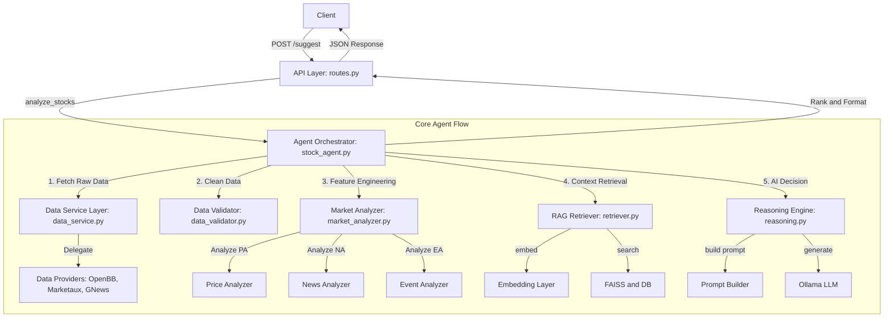

# AI Stock Agent: End-to-End Execution Flow

This document outlines the detailed execution flow of the AI Stock Agent backend. It covers the complete lifecycle of a request from the API entry point down through the data, analysis, RAG, and reasoning layers, and back up to the client response.

---

## 1. High-Level Architecture Diagram

---

## 2. Detailed Method-to-Method Execution Trace

### Phase 1: API Entry Point

#### `router.suggest_stocks(request: SuggestRequest)`
* **Module:** `src/api/routes.py`
* **Intent:** Expose the application via an HTTP POST endpoint to receive stock recommendation requests.
* **Input:** `SuggestRequest` containing a list of `symbols` (e.g., `["AAPL", "MSFT"]`) and `lookback_days` (default 90).
* **Core Logic:** 
  1. Validates the input payload to ensure symbols exist.
  2. Forwards the payload to `StockAgent.analyze_stocks()`.
  3. Receives the raw dictionary response from the agent.
  4. Maps the raw response into structured Pydantic models (`SuggestResponse` & `SuggestionItem`).
* **Output:** HTTP 200 `SuggestResponse` containing ranked items, or HTTP 500 on failure.

---

### Phase 2: Agent Orchestration Layer

#### `StockAgent.analyze_stocks(symbols: List[str], lookback_days: int)`
* **Module:** `src/agent/stock_agent.py`
* **Intent:** Act as the central brain orchestrating the sequential execution of data fetching, signal analysis, retrieval, reasoning, and final scoring for all stocks.
* **Input:** List of stock ticker symbols and lookback duration.
* **Core Logic:** (Executes a loop for each symbol)
  1. **Data Fetching:** Calls `DataService` to get raw prices, news, and corporate actions. Skip if price data is missing.
  2. **Data Cleaning:** Passes raw data to `DataValidator.clean_*` methods to standardize schemas and handle NaNs/nulls.
  3. **Signal Generation:** Calls `MarketAnalyzer.generate_signals()` passing the clean data to extract mathematical signals.
  4. **Context Retrieval:** Calls `RAGRetriever.retrieve()` (if configured) to fetch up-to-date, semantically relevant news from the local FAISS index + PostgreSQL metadata store.
  5. **LLM Reasoning:** Calls `ReasoningEngine.make_decision()` passing both the quantitative signals and the RAG context to get an AI decision (Bullish/Bearish/Neutral) and reasoning text.
  6. **Scoring:** Calculates an algorithmic composite score: `(momentum * 0.4) + (sentiment_score * 0.4) + (event_score * 0.2)`.
  7. **Aggregation:** Appends the result into a list of `RankedSuggestion` objects.
* **Post-Loop Logic:** Sorts the accumulated suggestions descending by the computed `score`.
* **Output:** Dictionary containing ordered and fully reasoned recommendations.

---

### Phase 3: Data Retrieval & Standardization

#### `DataService.get_price_data/get_news/get_corporate_actions`
* **Module:** `src/data/services/data_service.py`
* **Intent:** Provide a unified façade for data retrieval applying the Dependency Inversion Principle.
* **Input:** `symbol` and `lookback`.
* **Core Logic:** Delegates execution directly to the injected `IDataProvider` (specifically `CompositeDataProvider` initialized in `routes.py`). Uses fallback/composite logic (e.g., OpenBB for prices, Marketaux primary for news, GNews as fallback).
* **Output:** Standardized domain models (`PriceBar`, `NewsItem`, `CorporateAction`).

---

### Phase 4: Feature Engineering & Analysis

#### `MarketAnalyzer.generate_signals(symbol, clean_prices, clean_news, clean_actions)`
* **Module:** `src/analysis/market_analyzer.py`
* **Intent:** Acts as a Facade orchestrator for isolated technical analyzers.
* **Core Logic:** 
  1. `PriceAnalyzer.analyze(clean_prices)`: Calculates `momentum` (returns), `volatility` (std dev of daily returns * sqrt(252)), and `trend` (moving averages SMA5 vs SMA20).
  2. `NewsAnalyzer.analyze(clean_news)`: Aggregates compound sentiment and calculates `sentiment_score` (-1.0 to 1.0).
  3. `EventAnalyzer.analyze(clean_actions)`: Generates an `event_score` based on corporate actions (dividends, splits).
* **Output:** `CombinedMarketSignal` dataclass grouping the three distinct sub-signals.

---

### Phase 5: RAG Pipeline

#### `RAGRetriever.retrieve(symbol, db_session, query, top_k)`
* **Module:** `src/rag/retriever.py`
* **Intent:** Intercepts real-time queries to enrich the LLM prompt with localized, historically persistent context.
* **Input:** Target `symbol` and DB async session.
* **Core Logic:**
  1. **Embed:** Passes query (e.g., "Recent context and news updates for AAPL") to `EmbeddingModel.embed_text()`, converting it to a 384-dimensional dense vector.
  2. **Search:** Executes `FAISSStore.search()`, identifying the top-K nearest L2 distance vectors in the local index and pulling full metadata (news body) via Postgres join.
  3. **Format:** Consolidates hits into a clean string block to avoid token overflow.
* **Output:** `RetrievalResult` containing the context string and raw item dictionary.

---

### Phase 6: LLM Reasoning & Prompt Building

#### `PromptBuilder.build_financial_reasoning_prompt(signals, context_text)`
* **Module:** `src/llm/prompt_builder.py`
* **Intent:** Safely frame quantitative variables and textual context into a strict constraint prompt.
* **Output:** A strict deterministic text prompt preventing hallucinations and demanding structured output (`Decision:` and `Reason:`).

#### `ReasoningEngine.make_decision(signals, context_text)`
* **Module:** `src/llm/reasoning.py`
* **Intent:** Connect structured application signals with the unstructured LLM reasoning model.
* **Input:** Engineered `signals` and RAG `context_text`.
* **Core Logic:**
  1. Uses `PromptBuilder` to assemble the text.
  2. Injects prompt into `LLMClient.generate_response()` which hits the local Ollama interface.
  3. Parses the raw text return securely via `_parse_response()` using Regex extraction. Matches explicitly for `"Decision: (Bullish|Bearish|Neutral)"` and captures the subsequent text as `"Reason: (...)"`.
* **Output:** `LLMDecision` instance (with safe "Neutral" fallbacks if LLM output fails regex parsing).

---

## 3. Key Patterns & Business Rules

1. **Dependency Inversion Principle (DIP):** The `DataService` does not depend on specific APIs (like OpenBB or Marketaux). It relies on `IDataProvider`, making the system immune to upstream API breakages.
2. **Composite Pattern:** In `routes.py`, `CompositeDataProvider` aggregates multiple news sources into one single provider interface, adding robust fallback redundancy if the primary fails.
3. **Deterministic Parsing:** AI outputs are notoriously unstable. `ReasoningEngine` enforces strict Regular Expressions to parse out the core decision, safely reverting to "Neutral" and preserving error strings if the LLM hallucinates an unexpected format.
4. **Resiliency over Failure:** Within `StockAgent`, a `try/except` wraps the evaluation of each individual symbol. A failure retrieving data or processing AAPL will not crash the API request containing MSFT.
5. **Score Calculation Logic:** The system heavily favors momentum and sentiment (40% weight each) over corporate events (20% weight), aligning with short-term predictive modeling.
