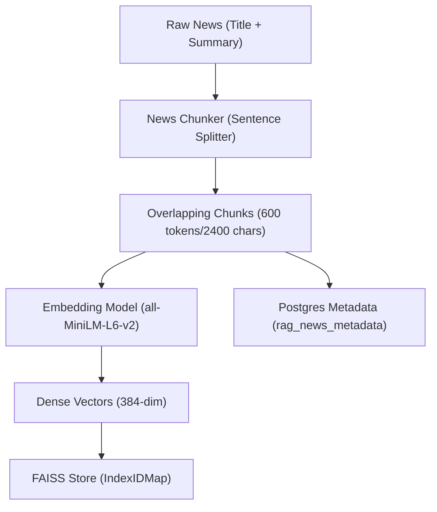
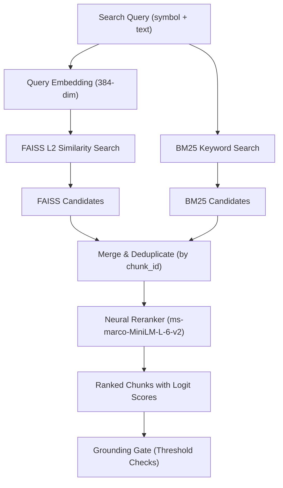
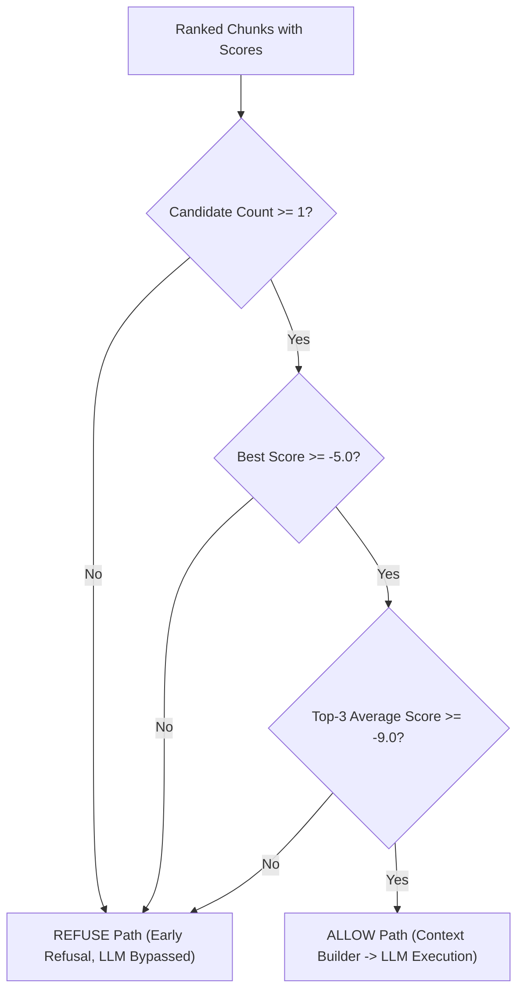

# 🚀 MVP 1: AI Stock Recommendation Agent - Consolidated Master Technical Task Log

This document consolidates the end-to-end development history, architectural design specifications, and validation checklists of the AI Stock Agent MVP. It merges foundational milestones, Advanced RAG design specifications (Steps 1 to 6.4), the E2E Validation Plan (Test Groups 1-13), the Final Audit criteria, and production calibration metrics.

---

## 🗺️ Architectural Ingestion & Retrieval flows

### 1. Ingestion & Indexing Flow


### 2. Online Query & Retrieval Flow


### 3. Grounding Gate Decision Flow


---

## 🏗️ Section 1 — Foundational Milestones (Phases 1-6)

### Phase 1 — Infrastructure & Requirements
* **Objective:** Establish the development environment with PostgreSQL and local LLM execution.
* **Specifications:**
  * **Environment Management:** Initialized Python project structure using `uv` package manager for fast, reproducible dependencies.
  * **Dependency Stack:** `openbb`, `pandas`, `sqlalchemy`, `asyncpg`, `fastapi`, `uvicorn`, `pydantic`, `sentence-transformers`, `faiss-cpu`, `rank_bm25`.
  * **Local Services:**
    * **PostgreSQL:** Setup relational database `stock_agent` for indicator and metadata storage.
    * **Ollama/Mistral:** Verified local LLM connection running model `phi3:mini` at `http://localhost:11434` for offline reasoning.

### Phase 2 — Boilerplate & Clean Architecture
* **Objective:** Design a modular, decoupled folder structure enforcing Separation of Concerns (SoC).
* **Specifications:**
  * **Directory Structure:** Created standard layout: `config`, `data`, `processing`, `analysis`, `llm`, `agent`, `api`.
  * **Centralized Configuration:** Configured [settings.py](file:///c:/Users/bhuwa/study/ai_stock_market/stock-agent/src/config/settings.py) using `pydantic-settings` to bind environment variables dynamically.
  * **Database Bridge:** Built [database.py](file:///c:/Users/bhuwa/study/ai_stock_market/stock-agent/src/config/database.py) using SQLAlchemy's async engine wrapping `asyncpg`.
  * **Standardized Logging:** Established [logger.py](file:///c:/Users/bhuwa/study/ai_stock_market/stock-agent/src/config/logger.py) for debugging.

### Phase 3 — Data Layer & Signal Engineering
* **Objective:** Fetch stock and news indicators and transform them into quantitative signal metrics.
* **Specifications:**
  * **SOLID Principles:** Defined `IDataProvider` interface and implemented [OpenBBProvider](file:///c:/Users/bhuwa/study/ai_stock_market/stock-agent/src/data/providers/openbb_provider.py).
  * **Data Validation:** Built [DataValidator](file:///c:/Users/bhuwa/study/ai_stock_market/stock-agent/src/processing/data_validator.py) to parse fields, normalize timestamps, and drop duplicate articles.
  * **Signal Engineering:** Developed modular analyzers inside [market_analyzer.py](file:///c:/Users/bhuwa/study/ai_stock_market/stock-agent/src/analysis/market_analyzer.py):
    * `PriceAnalyzer`: Calculates SMA trend directions, Momentum (5-day return), and Volatility (Standard Deviation).
    * `NewsAnalyzer`: Derives text sentiment scores (-1.0 to 1.0) using deterministic keyword matches.
    * `EventAnalyzer`: Scores corporate activities (split events, dividends, earnings updates).

### Phase 4 — LLM Reasoning Integration
* **Objective:** Expose signal matrices to the local LLM to generate recommendations.
* **Specifications:**
  * **LLM Client:** Implemented [LLMClient](file:///c:/Users/bhuwa/study/ai_stock_market/stock-agent/src/llm/llm_client.py) calling Ollama's generating endpoint with connection timeout handling.
  * **Prompt Design:** Built `PromptBuilder` to format signals into a structured financial prompt.
  * **Reasoning Engine:** Developed [ReasoningEngine](file:///c:/Users/bhuwa/study/ai_stock_market/stock-agent/src/llm/reasoning.py) to extract decisions and reasons via regex parsing, falling back to a structured `"Neutral"` decision on exceptions.

### Phase 5 — Agent Orchestration
* **Objective:** Coordinate the complete pipeline across multiple tickers and rank outcomes.
* **Specifications:**
  * **Orchestration:** Built [StockAgent](file:///c:/Users/bhuwa/study/ai_stock_market/stock-agent/src/agent/stock_agent.py) looping through tickers: Ingest $\rightarrow$ Clean $\rightarrow$ Index $\rightarrow$ Analyze $\rightarrow$ Retrieve Context $\rightarrow$ Decipher Decision $\rightarrow$ Score Tickers.
  * **Weighted Scoring Formula:** `(Momentum * 0.4) + (Sentiment * 0.4) + (EventScore * 0.2)`.
  * **Fault Isolation:** Ticker iterations wrapped in isolation try/except blocks to prevent global batch crashes.

### Phase 6 — REST API Gateway
* **Objective:** Serve recommendations over HTTP REST routes with strict contracting.
* **Specifications:**
  * **REST Router:** Built [routes/__init__.py](file:///c:/Users/bhuwa/study/ai_stock_market/stock-agent/src/api/routes/__init__.py) exposing `POST /suggest`.
  * **Contracts:** Enforced request/response schema structures using `Pydantic` models.
  * **Lifecycle Hooking:** Registered FastAPI context callbacks verifying PostgreSQL async connectivity before accepting traffic.

---

## 🧠 Section 3 — Advanced RAG Pipeline Tasks (Steps 1-6.4)

### 📋 Task 1 — News Chunking & Token Estimation (Step 1)
* **Objective:** Implement a deterministic text splitter preserving sentence coherence and carrying semantic overlap.
* **Implementation Rules:**
  * **Strategy:** Sentence-based length boundary validation. Accumulate complete sentences rather than splitting mid-sentence.
  * **Size Approximation:** Target size = `600 tokens` (estimated at `2400 characters` using the 1 token $\approx$ 4 characters heuristic).
  * **Overlap Boundary:** Carry forward the last `100 tokens` (`400 characters`) into the next chunk.
  * **Combined Input Format:**
    ```text
    Title: {title}
    Summary: {summary}
    ```
  * **Chunk Schema:**
    * `chunk_id` (str): Generated UUID or composite key.
    * `source_id` (str): Original news article ID link.
    * `chunk_index` (int): Index position within the parent article.
    * `symbol` (str): Ticker symbol association.
    * `timestamp` (datetime): Extracted publication timestamp.
    * `chunk_text` (str): Coherent chunk text.
  * **Common Errors to Avoid:**
    * ❌ Splitting text mid-sentence or mid-word (violates readability).
    * ❌ Zero overlap boundaries (leads to critical context gaps at chunk edges).
    * ❌ Overly large chunks (dilutes semantic resolution).
    * ❌ Empty/Null field crashes.
  * **Unit Testing Requirements:**
    * Test 1 (Short article): Returns exactly 1 chunk.
    * Test 2 (Long article): Returns multiple chunks with correct sentence overlap.
    * Test 3 (Edge case): Empty or null title/summary handles gracefully.

### 📋 Task 2 — Chunk Embedding & Vector Storage (Step 2)
* **Objective:** Generate dense vectors per chunk and persist them into a vector index mapped to a SQL database.
* **Implementation Rules:**
  * **Embedding Model:** Local `all-MiniLM-L6-v2` generating 384-dimensional float embeddings.
  * **Vector Database:** [faiss_store.py](file:///c:/Users/bhuwa/study/ai_stock_market/stock-agent/src/rag/faiss_store.py) wrapping FAISS FlatL2 index inside an `IndexIDMap` to support querying and addition by specific relational IDs.
  * **Relational Database:** Create PostgreSQL table `rag_news_metadata` to map vector `index_id` to its corresponding metadata properties:
    ```sql
    CREATE TABLE rag_news_metadata (
        id SERIAL PRIMARY KEY,
        chunk_id VARCHAR(100) UNIQUE,
        symbol VARCHAR(20),
        chunk_text TEXT,
        source_id VARCHAR(100),
        chunk_index INT,
        timestamp TIMESTAMP WITHOUT TIME ZONE
    );
    ```
  * **Consistency Checks:** Ensure same embedding model (all-MiniLM-L6-v2) and dimension (384) are used across indexing and queries.
  * **Data Backfilling:** Delete old document-level tables, re-chunk historic articles, embed chunk-by-chunk, and insert into Postgres + FAISS index.

### 📋 Task 3 — Hybrid Retrieval (Vector + Keyword Search) (Step 3)
* **Objective:** Design an orchestrator combining vector semantic matches and BM25 keyword matches to prevent missing exact corporate events.
* **Implementation Rules:**
  * **BM25 Module:** [bm25_retriever.py](file:///c:/Users/bhuwa/study/ai_stock_market/stock-agent/src/rag/bm25_retriever.py) initializing a tokenized, memory-based `BM25Okapi` index over retrieved database chunks.
  * **Orchestrator Design:** [hybrid_retriever.py](file:///c:/Users/bhuwa/study/ai_stock_market/stock-agent/src/rag/hybrid_retriever.py) taking `faiss_store`, `bm25_retriever`, and `embedder` via constructor Dependency Injection (DIP compliance).
  * **Union & Deduplication:** Concurrently fetch results from both retrieval engines (querying pool size top_k * 4) and deduplicate matches strictly by `chunk_id` using a Python `set`.
  * **API Contract:** Expose `search(query: str, symbol: str, db_session: AsyncSession, top_k: int)` returning a unified list of raw retrieved metadata records.

### 📋 Task 4 — Cross-Encoder Neural Reranking (Step 4)
* **Objective:** Score and re-sort candidate chunks using a transformer model to filter out irrelevant background noise.
* **Implementation Rules:**
  * **Model:** Local `cross-encoder/ms-marco-MiniLM-L-6-v2` Cross-Encoder, loaded into memory at startup.
  * **Reranker Module:** [reranker.py](file:///c:/Users/bhuwa/study/ai_stock_market/stock-agent/src/rag/reranker.py) exposing `rerank(query: str, candidates: List[RagNewsMetadata], top_k: int)`.
  * **Interface Contracts:** Reranker remains retrieval-source agnostic. Accepts any retrieved chunk list, generates similarity logits, sorts descending, and returns the top results.

### 📋 Task 5 — Grounding Gating & Citation Context (Step 5)
* **Objective:** Apply strict logical rules to verify retrieval quality, build trace-back citations, or bypass the LLM early on failures.
* **Implementation Rules:**
  * **Grounding Gating Rules:** Expose thresholds in `settings.py` and enforce them dynamically:
    1. **Density Gate:** Verify candidate chunk count $\ge$ `GROUNDING_MIN_CHUNKS` (default 1).
    2. **Peak Gate:** Verify that the single highest reranker logit score is $\ge$ `GROUNDING_MIN_SCORE` (tuned to `-5.0`).
    3. **Average Quality Gate:** Verify that the average logit score of the Top-3 reranker chunks is $\ge$ `GROUNDING_MIN_TOP3_AVERAGE` (tuned to `-9.0`).
  * **ALLOW Execution Path:** If grounding checks pass:
    * Map chunks to sequential `[1]`, `[2]`, `[3]` bracketed numbers using [context_builder.py](file:///c:/Users/bhuwa/study/ai_stock_market/stock-agent/src/rag/context_builder.py).
    * Format context output displaying: `[1] Source: {source_id} (Date) | {chunk_text}`.
    * Inject formatted context into prompt template and invoke local LLM.
  * **REFUSE Execution Path (Bypass):** If any grounding gate rule fails:
    * Log warning message detailing the failure reason.
    * Bypass `PromptBuilder` entirely.
    * Bypass local LLM execution.
    * Immediately return a structured `Neutral` decision and explanation back to the REST client: *"Insufficient evidence available to answer this question reliably."*

### 📋 Task 6 — API Endpoints & Calibration Tuning (Step 6)
* **Objective:** Expose validation routes, run live calibration loops, and configure production settings.
* **Implementation Rules:**
  * **REST Route Integrations:**
    * `POST /debug/retrieval`: Returns raw FAISS, BM25, and merged candidate arrays separately.
    * `POST /debug/rerank`: Returns candidate chunks sorted by Cross-Encoder logit scores.
    * `POST /debug/grounding`: Breaks down rule decisions (ALLOW/REFUSE) alongside best score and Top-3 average score metrics.
    * `/health`: dynamic readiness probes checking PostgreSQL connection, FAISS index status, and Ollama tags.
  * **Calibration Query Generation:** Map raw stock exchange tickers to clean company names (e.g. `INFY` $\rightarrow$ `Infosys`, `RELIANCE.NS` $\rightarrow$ `Reliance Industries`) for semantic retrieval query generation, recorded in [calibration_report.md](file:///c:/Users/bhuwa/study/ai_stock_market/stock-agent/calibration_report.md) and [calibration_results.json](file:///c:/Users/bhuwa/study/ai_stock_market/stock-agent/calibration_results.json).

---

## 🔍 Section 4 — Architectural Final Audit (ph_1_audit.md Roadmap)

### 📋 Task 7 — Component Integration & Verification Audit
* **Objective:** Run a full structural audit to identify missing links, instantiate dependencies properly, and weed out orphaned classes.
* **Audit Checklists & Rules:**
  * **Mermaid Design Map Validation:** Verify the codebase strictly implements the actual pipeline: Ingestion $\rightarrow$ Chunker $\rightarrow$ Embedder $\rightarrow$ FAISS/Postgres $\rightarrow$ Hybrid $\rightarrow$ Rerank $\rightarrow$ Grounding $\rightarrow$ CitationContextBuilder $\rightarrow$ LLM.
  * **Component Inventory Probes:** Run runtime checks verifying:
    * `NewsChunker`: Exists, called during indexing, outputs overlaps.
    * `EmbeddingModel`: Exists, outputs 384-dimensional arrays.
    * `FAISSStore`: Loaded successfully, L2 index queries correctly.
    * `BM25Retriever`: Initialized, keyword ranks candidates.
    * `Reranker`: Instantiated once at server startup, scores candidates.
    * `GroundingService`: Instantiated once, executes `evaluate()`, output is NOT ignored.
    * `CitationContextBuilder`: Formats citations sequentially, chunk IDs preserved.
    * `PromptBuilder`: Integrates citations context block, model `phi3:mini` executes.
  * **Orphan Detection Rule:** Identify and remove dead legacy classes from codebase (e.g. removing unused `RetrievalResult` dataclass from `retriever.py` and `rag/__init__.py`).
  * **Dependency Injection Validation:** Ensure higher-level orchestrators receive abstractions (e.g. `FAISSStore`, `BM25Retriever`) via constructor injection rather than instantiating classes directly inside business methods.

---

## 🧪 Section 5 — End-to-End Validation Plan (E2E_test_1.md Roadmap)

### 📋 Task 8 — E2E Test Suite & Latency Baselines
* **Objective:** Run modular test groups verifying pipeline parts in isolation and together, recording performance indicators.
* **Verification Checklist (Test Groups 1-13):**
  * **Group 1 (Chunking):** Verify sentence splits, overlap bounds, character token estimation.
  * **Group 2 (Embeddings):** Verify consistent 384 dimensions, no null output vectors.
  * **Group 3 (FAISS Store):** Search `Infosys earnings` and verify Top-K.
  * **Group 4 (BM25 Index):** Search `Infosys dividend record date` and verify exact term match prioritizations.
  * **Group 5 (Hybrid Merge):** Verify duplicate chunk IDs are removed, retaining only a single copy.
  * **Group 6 (Reranker Engine):** Verify candidates are sorted in descending order of logits.
  * **Group 7 (Grounding Gate):** Validate `is_grounded` outcomes:
    * Scenario A: Strong evidence $\rightarrow$ ALLOW.
    * Scenario B: Empty/low chunk count $\rightarrow$ REFUSE.
    * Scenario C: Peak score below `-5.0` $\rightarrow$ REFUSE.
    * Scenario D: Top-3 average below `-9.0` $\rightarrow$ REFUSE.
  * **Group 8 (Citations):** Verify bracketed citation list sequential assignments.
  * **Group 9 (Prompting):** Verify signals and citation context strings are inserted.
  * **Group 10 (ALLOW Success Path E2E):** Send `/suggest` query for INFY with relevant news. Verify HTTP 200, LLM outputs, citation arrays.
  * **Group 11 (REFUSE Refusal Path E2E):** Send `/suggest` query for SBIN.NS with weak/irrelevant context. Verify HTTP 200, LLM bypass, Neutral output.
  * **Group 12 (REST API Schema):** Assert Pydantic validation schemas.
  * **Group 13 (Performance Diagnostics):** Record FAISS lookup times, BM25 lookup times, Cross-Encoder inference times, and local LLM throughput (tokens/sec).

---

## 📈 Tuned Production Settings
The finalized grounding parameters are saved in [.env](file:///c:/Users/bhuwa/study/ai_stock_market/stock-agent/.env) and active in [settings.py](file:///c:/Users/bhuwa/study/ai_stock_market/stock-agent/src/config/settings.py):
* `GROUNDING_MIN_SCORE=-5.0`
* `GROUNDING_MIN_TOP3_AVERAGE=-9.0`
* `GROUNDING_MIN_CHUNKS=1`
