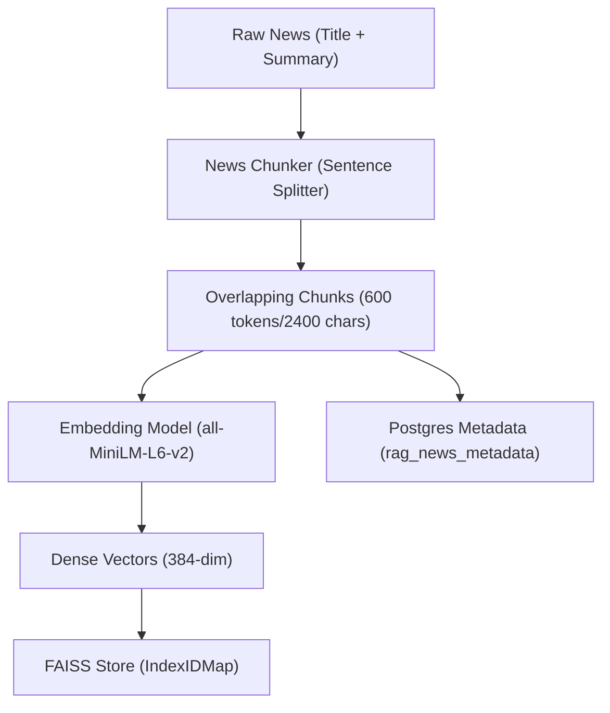
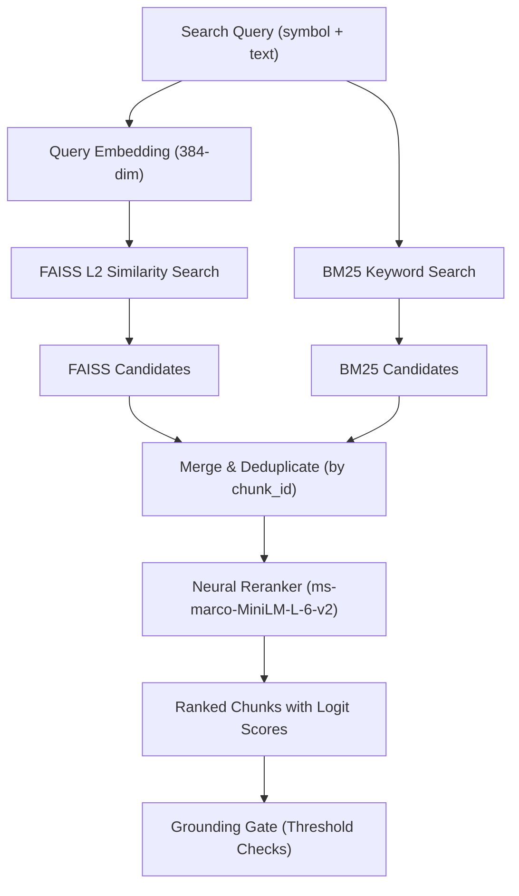
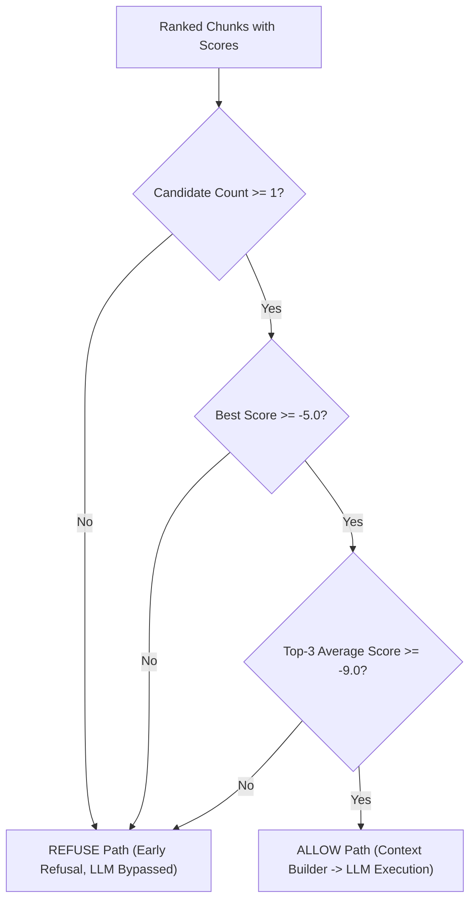

# 🚀 MVP 1: AI Stock Recommendation Agent - Consolidated Technical Task Log

This document consolidates the end-to-end development history and task specifications of the AI Stock Agent MVP. It tracks foundational milestones, Advanced RAG design specifications (Steps 1 to 6.4), and production calibration metrics.

---

## 🗺️ Architectural Ingestion & Retrieval flows

### 1. Ingestion & Indexing Flow

### 2. Online Query & Retrieval Flow

### 3. Grounding Gate Decision Flow

---

## 🏗️ Section 1 — Foundational Milestones (Phases 1-6)

### Phase 1 — Infrastructure & Requirements
* **Objective:** Establish the development environment with PostgreSQL and local LLM execution.
* **Achievements:**
  * Initialized Python environment using `uv` package manager.
  * Verified local `Ollama` connectivity running the `phi3:mini` model.
  * Configured local `PostgreSQL` instance to store target stock indicators and metadata.

### Phase 2 — Boilerplate & Clean Architecture
* **Objective:** Design a scalable directory structure enforcing Separation of Concerns (SoC).
* **Achievements:**
  * Established the `src/` hierarchy: [settings.py](file:///c:/Users/bhuwa/study/ai_stock_market/stock-agent/src/config/settings.py), [database.py](file:///c:/Users/bhuwa/study/ai_stock_market/stock-agent/src/config/database.py), [logger.py](file:///c:/Users/bhuwa/study/ai_stock_market/stock-agent/src/config/logger.py).
  * Built async PostgreSQL engine using `SQLAlchemy` + `asyncpg`.

### Phase 3 — Data Layer & Signal Engineering
* **Objective:** Implement data providers, clean incoming market data, and compile technical signals.
* **Achievements:**
  * Implemented [OpenBBProvider](file:///c:/Users/bhuwa/study/ai_stock_market/stock-agent/src/data/providers/openbb_provider.py) fetching historical prices, corporate actions, and news.
  * Developed `PriceAnalyzer` (computes SMA, Momentum, Volatility), `NewsAnalyzer` (derives keyword sentiment), and `EventAnalyzer` (scores corporate actions).

### Phase 4 — LLM Reasoning Integration
* **Objective:** Connect signals to the local LLM for structured analysis decisions.
* **Achievements:**
  * Developed [ReasoningEngine](file:///c:/Users/bhuwa/study/ai_stock_market/stock-agent/src/llm/reasoning.py) querying local Ollama.
  * Implemented prompt templates translating quantitative signals into structured analysis responses (`Bullish`, `Bearish`, or `Neutral`).

### Phase 5 — Agent Orchestration
* **Objective:** Coordinate the analytical modules across multiple tickers and rank final choices.
* **Achievements:**
  * Built [StockAgent](file:///c:/Users/bhuwa/study/ai_stock_market/stock-agent/src/agent/stock_agent.py).
  * Enforced weighted signal scoring formula: `(Momentum * 0.4) + (Sentiment * 0.4) + (EventScore * 0.2)`.

### Phase 6 — REST API Exposure
* **Objective:** Expose stock agent recommendations through REST routes.
* **Achievements:**
  * Created `POST /suggest` endpoint with Pydantic request/response schemas.
  * Registered lifespan callbacks to verify async database connection during startup.

---

## 🧠 Section 2 — Advanced RAG Implementation (Steps 1-6.4)

### 📋 Task 1 — News Chunking & Token Estimation
* **Objective:** Split news documents into coherent semantic chunks with overlapping boundaries to avoid context fragmentation.
* **Specifications:**
  * **Splitter Strategy:** Sentence-based length control. Splitting text by sentence boundaries (`.`, `?`, `!`) and accumulating chunks.
  * **Chunk Size:** Configured to `600 tokens` (approximated at `2400 characters`).
  * **Overlap:** Configured to `100 tokens` (`400 characters`) carried forward into the subsequent chunk.
  * **Database Entity:** Each chunk is mapped to a row containing: `chunk_id`, `source_id`, `chunk_index`, `symbol`, `timestamp`, and `chunk_text`.
  * **Test Scenarios:** Verify short articles return exactly 1 chunk; long articles yield multiple overlapping chunks; empty inputs fail gracefully.

### 📋 Task 2 — Chunk Embedding & Vector Indexing
* **Objective:** Embed chunks independently and link dense vectors to relational database metadata.
* **Specifications:**
  * **Embedder Module:** [embedder.py](file:///c:/Users/bhuwa/study/ai_stock_market/stock-agent/src/rag/embedder.py) loading `all-MiniLM-L6-v2` locally (generating 384-dimensional float arrays).
  * **Vector Store:** [faiss_store.py](file:///c:/Users/bhuwa/study/ai_stock_market/stock-agent/src/rag/faiss_store.py) initializing a FAISS L2 Index Flat mapping (`IndexIDMap`) vector IDs to PostgreSQL primary keys.
  * **Relational Schema:** `rag_news_metadata` table storing metadata mappings to prevent metadata truncation during similarity searches.
  * **Backfill System:** Logic to clean stale vectors, re-chunk existing articles, and populate Postgres + FAISS index simultaneously.

### 📋 Task 3 — Hybrid Retrieval (Vector + Keyword Search)
* **Objective:** Implement a search system merging vector similarity and keyword relevance to fetch exact matches (dates, ticker symbols).
* **Specifications:**
  * **BM25 Module:** [bm25_retriever.py](file:///c:/Users/bhuwa/study/ai_stock_market/stock-agent/src/rag/bm25_retriever.py) instantiating an in-memory `BM25Okapi` index over tokenized chunk texts.
  * **Orchestrator:** [hybrid_retriever.py](file:///c:/Users/bhuwa/study/ai_stock_market/stock-agent/src/rag/hybrid_retriever.py) executing FAISS search and BM25 search concurrently.
  * **Merge & Deduplication:** Combines both candidate pools (Top-K * 4 size) and deduplicates strictly on `chunk_id` using a set.

### 📋 Task 4 — Cross-Encoder Neural Reranking
* **Objective:** Score candidate relevance against queries using a Cross-Encoder transformer model.
* **Specifications:**
  * **Model:** Local `cross-encoder/ms-marco-MiniLM-L-6-v2`.
  * **Reranker Module:** [reranker.py](file:///c:/Users/bhuwa/study/ai_stock_market/stock-agent/src/rag/reranker.py) accepting `query`, `candidate_chunks`, and returning sorted `(chunk, score)` tuples.
  * **Top-K:** Retains only the Top-K sorted chunks (typically Top-5) to serve as prompt evidence context.

### 📋 Task 5 — Grounding Gating & LLM Bypass Flow
* **Objective:** Prevent LLM hallucinations by verifying context quality and skipping prompt building if evidence is weak.
* **Specifications:**
  * **Grounding Service:** [grounding.py](file:///c:/Users/bhuwa/study/ai_stock_market/stock-agent/src/rag/grounding.py) applying deterministic validation rules:
    * **Rule 1 (Density):** Candidate count $\ge$ `GROUNDING_MIN_CHUNKS` (typically 1).
    * **Rule 2 (Peak Relevance):** Best logit score $\ge$ `GROUNDING_MIN_SCORE` (tuned to `-5.0`).
    * **Rule 3 (Average Quality):** Average of the Top-3 scores $\ge$ `GROUNDING_MIN_TOP3_AVERAGE` (tuned to `-9.0`).
  * **ALLOW Flow:** Evidence passes checks $\rightarrow$ [CitationContextBuilder](file:///c:/Users/bhuwa/study/ai_stock_market/stock-agent/src/rag/context_builder.py) assigns gapless sequential citation numbers (`[1]`, `[2]`) $\rightarrow$ Prompt formatted with citations $\rightarrow$ LLM executes.
  * **REFUSE Flow (Bypass):** Grounding rules fail $\rightarrow$ Prompt and LLM are bypassed $\rightarrow$ structured `Neutral` decision returned: *"Insufficient evidence available to answer this question reliably."*

### 📋 Task 6 — API Debug Endpoints & Calibration Tuning
* **Objective:** Expose intermediate metrics for verification and tune gating thresholds.
* **Specifications:**
  * **Debug Endpoints:**
    * `POST /debug/retrieval`: Returns raw FAISS, BM25, and merged candidate arrays separately.
    * `POST /debug/rerank`: Returns candidate chunks sorted by reranking logit scores.
    * `POST /debug/grounding`: Breaks down rule decisions (ALLOW/REFUSE) alongside best score and Top-3 average score metrics.
  * **Subsystem Health checks:** `/health` dynamically tests async connection status to PostgreSQL, FAISS store integrity, and Ollama reachability.
  * **Calibration Query Generation:** Map exchange tickers to company names (e.g. `INFY` $\rightarrow$ `Infosys`, `RELIANCE.NS` $\rightarrow$ `Reliance Industries`) for semantic retrieval query generation, recorded in [calibration_report.md](file:///c:/Users/bhuwa/study/ai_stock_market/stock-agent/calibration_report.md) and [calibration_results.json](file:///c:/Users/bhuwa/study/ai_stock_market/stock-agent/calibration_results.json).

---

## 📈 Calibrated Production Thresholds
Following E2E validation and regression testing, the production thresholds are loaded via [.env](file:///c:/Users/bhuwa/study/ai_stock_market/stock-agent/.env):
* `GROUNDING_MIN_SCORE=-5.0`
* `GROUNDING_MIN_TOP3_AVERAGE=-9.0`
* `GROUNDING_MIN_CHUNKS=1`
