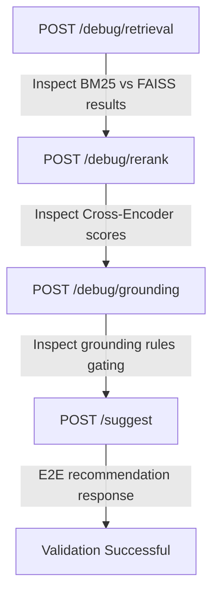

# 📘 API Capability Audit & Endpoint Coverage Review

## Objective

Perform a complete audit of the current AI Stock Agent system.

The goal is to determine:

1. Which features are implemented.
2. Which features are accessible through APIs.
3. Which features are not exposed.
4. Which features require new endpoints.
5. Whether existing endpoints return sufficient information.

---

# Current System Components

The codebase currently contains implementations for:

```text
News Collection
Market Data Collection
Signal Generation
Chunking
Embedding Generation
FAISS Vector Search
BM25 Retrieval
Hybrid Retrieval
Reranking
Grounding
Citation Context Builder
Prompt Builder
LLM Reasoning
Recommendation Generation
```

---

# Audit Requirements

For every implemented feature determine:

```text
Implemented?
Used?
Exposed?
Testable?
```

---

# Phase 1 — Endpoint Inventory

---

## Task

Scan FastAPI application.

Identify:

```text
routers
controllers
endpoints
request models
response models
```

---

Generate report:

```text
Endpoint
Method
Purpose
Request Model
Response Model
```

---

Example

```text
POST /suggest

Request:
StockAnalysisRequest

Response:
RecommendationResponse
```

---

# Phase 2 — Feature Mapping

---

Map every feature to an endpoint.

Example:

```text
Feature:
Hybrid Retrieval

Endpoint:
?
```

---

Possible outputs:

```text
EXPOSED
PARTIALLY EXPOSED
NOT EXPOSED
```

---

# Phase 3 — Feature Accessibility Matrix

---

Generate matrix.

Example:

```text
Feature                     Status

Chunking                    NOT EXPOSED
Embeddings                  NOT EXPOSED
FAISS Search                NOT EXPOSED
BM25 Search                 NOT EXPOSED
Hybrid Retrieval            NOT EXPOSED
Reranker                    NOT EXPOSED
Grounding                   NOT EXPOSED
Citation Builder            NOT EXPOSED
Recommendation Engine       EXPOSED
```

---

# Phase 4 — Missing Endpoint Detection

---

Identify features that cannot currently be tested independently.

Examples:

```text
Hybrid Retrieval
Reranker
Grounding
Citation Builder
```

---

For each feature recommend:

```text
New Endpoint?
Yes / No
```

---

# Phase 5 — Recommended Debug Endpoints

---

These endpoints are intended for development and testing.

---

## Endpoint

```text
POST /debug/retrieval
```

Purpose:

```text
Test Hybrid Retrieval
```

Request:

```json
{
  "symbol": "INFY",
  "query": "Should I buy Infosys?"
}
```

Response:

```json
{
  "retrieved_chunks": [...]
}
```

---

## Endpoint

```text
POST /debug/rerank
```

Purpose:

```text
Test Reranker
```

Response:

```json
{
  "reranked_chunks": [...],
  "scores": [...]
}
```

---

## Endpoint

```text
POST /debug/grounding
```

Purpose:

```text
Test GroundingService
```

Response:

```json
{
  "is_grounded": true,
  "confidence_score": 0.78,
  "reason": "..."
}
```

---

## Endpoint

```text
POST /debug/citations
```

Purpose:

```text
Test CitationContextBuilder
```

Response:

```json
{
  "formatted_text": "...",
  "citations": [...]
}
```

---

## Endpoint

```text
POST /debug/prompt
```

Purpose:

```text
Inspect final prompt sent to LLM
```

Response:

```json
{
  "prompt": "..."
}
```

---

# Phase 6 — End-to-End Validation Endpoint

---

Verify existing endpoint.

Example:

```text
POST /suggest
```

---

Determine:

Does it currently execute:

```text
Hybrid Retrieval
 ↓
Reranker
 ↓
Grounding
 ↓
Citation Builder
 ↓
Prompt Builder
 ↓
LLM
```

---

If not:

Generate implementation plan.

---

# Phase 7 — Request Model Review

---

Review all request models.

Verify:

```text
symbol
query
top_k
debug
```

and other parameters.

---

Recommend missing fields.

Example:

```json
{
  "symbol": "INFY",
  "query": "Should I buy Infosys?",
  "debug": true
}
```

---

# Phase 8 — Response Model Review

---

Verify responses contain:

```text
decision
confidence
reason
citations
```

---

Recommend improvements.

---

# Phase 9 — API Testing Capability

---

Determine whether the entire system can be validated using only APIs.

Desired Result:

```text
YES
```

---

Required APIs:

```text
/debug/retrieval
/debug/rerank
/debug/grounding
/debug/citations
/debug/prompt
/suggest
```

---

# Deliverables

Generate:

1. Endpoint Inventory
2. Feature Coverage Matrix
3. Missing Endpoint Report
4. Proposed Request Models
5. Proposed Response Models
6. Debug Endpoint Plan
7. API Testing Plan

---

# Success Criteria

The system should allow validation of:

```text
Chunking
Embeddings
FAISS
BM25
Hybrid Retrieval
Reranking
Grounding
Citation Builder
Prompt Builder
LLM Response
```

without requiring direct service invocation.

All major functionality should be testable through FastAPI endpoints.

---

# 📑 API Capability Audit & Endpoint Coverage Report

This report documents the capability audit and coverage review of the AI Stock Agent APIs.

---

## 1. Endpoint Inventory

The FastAPI application exposes the following endpoints (including the newly implemented Phase 2 debug routes):

| Endpoint | Method | Purpose | Request Model | Response Model |
| :--- | :--- | :--- | :--- | :--- |
| `POST /suggest` | `POST` | Executes the E2E stock recommendation pipeline (RAG + Signal generation + LLM decision). | `SuggestRequest` | `SuggestResponse` |
| `GET /health` | `GET` | Evaluates check probes for DB, FAISS, LLM, and API router. | None | `HealthResponse` |
| `GET /debug/symbol/{symbol}` | `GET` | QA debug endpoint executing the full `analyze_stocks` pipeline for a single ticker. | None (path param: `symbol`, query param: `lookback_days`) | `SuggestResponse` |
| `POST /debug/retrieval` | `POST` | **[NEW]** Debug endpoint returning FAISS, BM25, and merged retrieval results separately. | `DebugRetrievalRequest` | `DebugRetrievalResponse` |
| `POST /debug/rerank` | `POST` | **[NEW]** Debug endpoint retrieving candidates and returning reranking scores. | `DebugRerankRequest` | `DebugRerankResponse` |
| `POST /debug/grounding` | `POST` | **[NEW]** Debug endpoint returning detailed grounding gating decisions and scores. | `DebugGroundingRequest` | `DebugGroundingResponse` |

---

## 2. Feature Coverage Matrix

Below is a detailed mapping of RAG and Signal components to their implementation and exposure status:

| System Component | Implemented? | Used in Pipeline? | Exposed via API? | Testable Independently? | Coverage Status |
| :--- | :---: | :---: | :---: | :---: | :--- |
| **News Collection** | Yes | Yes | No | No | `PARTIALLY EXPOSED` (via `/suggest` logs) |
| **Market Data Collection** | Yes | Yes | No | No | `PARTIALLY EXPOSED` (via `/suggest` logs) |
| **Signal Generation** | Yes | Yes | No | No | `PARTIALLY EXPOSED` (via `/suggest` breakdown) |
| **Chunking** | Yes | Yes | No | No | `NOT EXPOSED` |
| **Embedding Generation** | Yes | Yes | No | No | `NOT EXPOSED` |
| **FAISS Vector Search** | Yes | Yes | Yes | Yes | `EXPOSED` (via `POST /debug/retrieval`) |
| **BM25 Retrieval** | Yes | Yes | Yes | Yes | `EXPOSED` (via `POST /debug/retrieval`) |
| **Hybrid Retrieval** | Yes | Yes | Yes | Yes | `EXPOSED` (via `POST /debug/retrieval`) |
| **Reranking** | Yes | Yes | Yes | Yes | `EXPOSED` (via `POST /debug/rerank`) |
| **Grounding Service** | Yes | Yes | Yes | Yes | `EXPOSED` (via `POST /debug/grounding`) |
| **Citation Context Builder**| Yes | Yes | No | No | `NOT EXPOSED` |
| **Prompt Builder** | Yes | Yes | No | No | `NOT EXPOSED` |
| **LLM Reasoning** | Yes | Yes | Yes | Yes | `EXPOSED` (via `/suggest`) |
| **Recommendation Engine** | Yes | Yes | Yes | Yes | `EXPOSED` (via `/suggest`) |

---

## 3. Missing Endpoint Report

The RAG pipeline accessibility has been significantly improved. The following components are now fully auditable and testable through the API layer:
* **FAISS, BM25, and Hybrid Retrieval** (testable via `POST /debug/retrieval`)
* **Neural Reranking** (testable via `POST /debug/rerank`)
* **Grounding Threshold Gating** (testable via `POST /debug/grounding`)

The remaining RAG components that are currently not exposed independently are:
1. **Citation Context Builder**: Formatting of preview strings and brackets is currently only testable end-to-end.
2. **Prompt Builder**: The final structured prompt sent to the LLM cannot be retrieved independently via API.

---

## 4. Implemented Request Models (Pydantic)

The following Pydantic schemas are defined under [schemas/debug.py](file:///c:/Users/bhuwa/study/ai_stock_market/stock-agent/src/api/schemas/debug.py):

```python
class DebugRetrievalRequest(BaseModel):
    symbol: str = Field(..., description="Stock symbol (e.g. INFY, AAPL)")
    query: str = Field(..., description="Search query string")
    top_k: int = Field(10, description="Number of candidate chunks to fetch")

class DebugRerankRequest(BaseModel):
    symbol: str = Field(..., description="Stock symbol (e.g. INFY, AAPL)")
    query: str = Field(..., description="Query string used for cross-encoder scoring")
    top_k: int = Field(10, description="Number of sorted chunks to return")

class DebugGroundingRequest(BaseModel):
    symbol: str = Field(..., description="Stock symbol (e.g. INFY, AAPL)")
    query: str = Field(..., description="Query string")
    top_k: int = Field(10, description="Number of candidate chunks")
```

---

## 5. Implemented Response Models (Pydantic)

The following response schemas are defined under [schemas/debug.py](file:///c:/Users/bhuwa/study/ai_stock_market/stock-agent/src/api/schemas/debug.py):

```python
class RetrievedChunkResponse(BaseModel):
    chunk_id: str
    symbol: str
    source_id: str
    timestamp: str | None = None
    chunk_text: str

class DebugRetrievalResponse(BaseModel):
    faiss_results: list[RetrievedChunkResponse]
    bm25_results: list[RetrievedChunkResponse]
    merged_results: list[RetrievedChunkResponse]

class RerankedChunkResponse(BaseModel):
    chunk_id: str
    score: float
    chunk_text: str

class DebugRerankResponse(BaseModel):
    reranked_chunks: list[RerankedChunkResponse]

class DebugGroundingResponse(BaseModel):
    is_grounded: bool
    confidence_score: float
    reason: str
    candidate_count: int
    best_score: float
    average_score: float
```

---

## 6. Debug Endpoint Router Setup

The routes are registered in [routes/debug.py](file:///c:/Users/bhuwa/study/ai_stock_market/stock-agent/src/api/routes/debug.py) and registered globally in the package initializer [routes/__init__.py](file:///c:/Users/bhuwa/study/ai_stock_market/stock-agent/src/api/routes/__init__.py):

1. **`POST /debug/retrieval`**
   * Calls `hybrid_retriever.search_detailed(query, symbol, db, top_k)`
   * Returns individual lists of FAISS results, BM25 results, and final merged candidates.
2. **`POST /debug/rerank`**
   * Calls `hybrid_retriever.search_detailed` to retrieve candidate pool (size top_k * 4), then runs `reranker.rerank(query, candidates, top_k)`
   * Returns sorted chunk texts paired with their Cross-Encoder scores.
3. **`POST /debug/grounding`**
   * Calls `hybrid_retriever.search_detailed` and `reranker.rerank` to build scored candidates, then runs `grounding_service.evaluate(query, ranked_pairs)`
   * Returns decision parameters, candidate counts, best score, and average score.

---

## 7. API Testing Plan

With the debug routes in place, the RAG pipeline can now be validated step-by-step through pure API interactions:



1. **Verify Retrieval Independent of Reranking**: Send a payload to `POST /debug/retrieval` and assert that FAISS returns semantic hits, BM25 returns exact keyword hits, and merged results are correctly deduplicated.
2. **Verify Model Scoring**: Send a query to `POST /debug/rerank` and assert that scores are in descending order and match expectations.
3. **Verify Refusal Gating Rules**: Send a query to `POST /debug/grounding` and verify that the grounding rules trigger refusals accurately for missing tickers or low-score news.
4. **E2E Integration Validation**: Run the standard `POST /suggest` loop to confirm all components weave together to yield the final recommendation.
